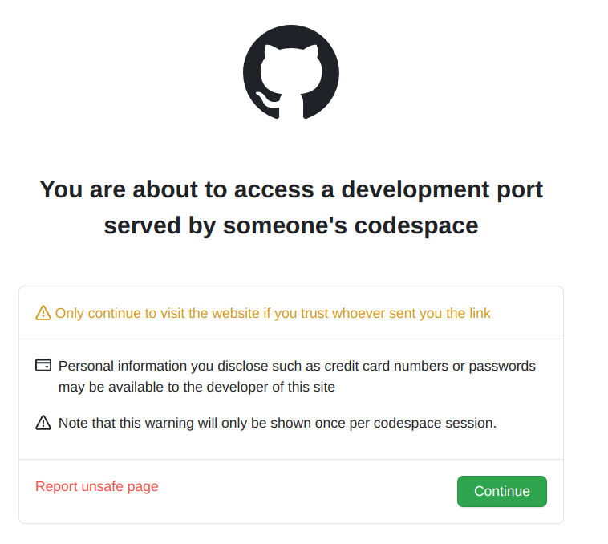

## Übungen

ZWEI

OBEN

Die Übungen sucht man im Verzeichnis `build/git-uebungen`.

Zur Hallo-Welt-Übung kommt man beispielsweis mit:

```bash
    $ cd build/git-uebungen/aufgaben/intro-hallo-welt
```

Falls das Übungsverzeichnis noch fehlt, oder nicht aktuell ist:

```bash
    $ ./gradlew clean assembleDist
```
    
## Per GitHub-Action gebautes Zip-File mit den Übungen

[Download `git-uebungen.zip`](https://github.com/bstachmann/git-workshop/releases/latest/download/git-uebungen.zip)

Den GitHub Actions Workflow [findet man hier](https://github.com/bstachmann/git-workshop/actions/workflows/zip-git-uebungen.yml).

### Exercises

Exercises can be found in `build/git-uebungen`.

 * `gradle run` to rebuild the exercises
 * `gradle distUebungenMarkdown` to update descriptions for the website. Commit and push.
 * `gradle distUebungenZip` to update descriptions for the website. Commit and push.

### Präsentation als Website auf `github.io`

Die Website wird als *GitHub Pages*  https://bstachmann.github.io/git-workshop/ gehosted.

### Website lokal lokal hosten

 * Port `8000`: [Website](http://localhost:8000) inklusive dynamischem Content (Teilnehmefortschritt) zum [Monitoring des Teilnehmerfortschrits](http://localhost:8000/progress). ([log-File](_log/webserver-with-progresstracking.log))
 * Port `4000`: Nur statische Website (identisch zu GitHub-Pages)  ([log-File](_log/jekyll.log))

 Die Server können per Script gestartet werden:

 ```bash
    $ scripts/run-all.sh
 ```

 ### Website von GitHub *codespace* hosten
 
 Starten per `scripts/run-all.sh`, wie oben.

 Auf dem Tab **Ports** den Port `8000` auf *public* setzen.

 Dann kann man den Link sharen. Die Teilnehmer müssen den Zugriff bestätigen.

 

## Remotes

```bash
 $ git remote add github https://github.com/bstachmann/git-workshop.git
 $ git remote add gitlab https://gitlab.com/bjoern.stachmann/git-workshop.git
```
`

UNTEN


asdfsad