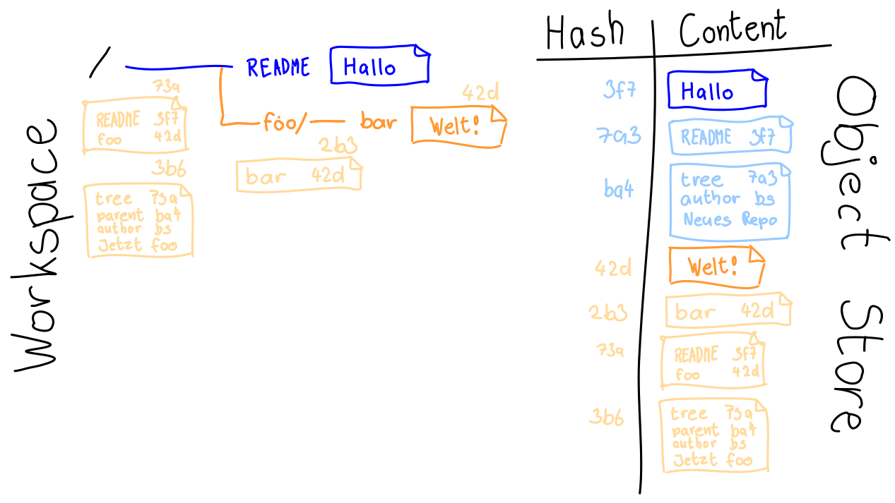

# Anatomie eines Commits

---

Das Herz von Git ist der sogenannte **Object Store**,
eine Datenbank, in der 
 
 * Inhalte von Dateien (**Blob**)
 * Verzeichnisse (**Tree**)\
   Auflistungen von Dateien
 * **Commits**\
   mitsamt Metadaten
   
gespeichert werden.

---

[Download](commits-im-object-store.svg)

---

---

Was genau ist in einem Commit enthalten?

    git log --pretty=raw

Insbesondere sind die (Posix) Permissions enthalten, nicht aber die Timestamps.

---

## Verzeichnisse

Verzeichnisse werden in Git nicht explizit versioniert.

Ein Verzeichnis muss mindestens eine Datei enthalten.

Ggf. legt man ein hidden File an, z. B. `.gitkeep`

---

### Übung: Commits erstellen

Starten sie im *Übungsverzeichnis* (wo sie das Zip-Archiv mit den
Übungen entpackt haben).
Öffnen sie die Anleitung im *Browser* (mit dem Kommando `start` auf
Windows, `xdg-open` auf Ubuntu,`open` auf MacOs).
**Achtung!** Es ist wichtig, die Übungen im *angegebenen
Startverzeichnis* zu beginnen. Achten Sie auf die Beschreibung:

    $ cd git-uebungen-<Zeitstempel z. B. 202005252000>
    $ start aufgaben/XX-commits-erstellen/index.html 
    $ cd aufgaben/<angegebenes Startverzeichnis>

Folgen Sie dann den weiteren Anweisungen.

