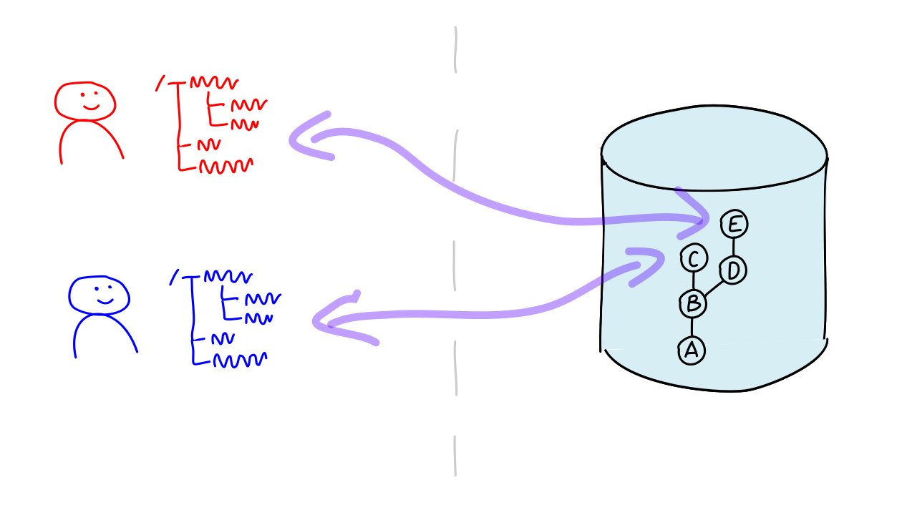
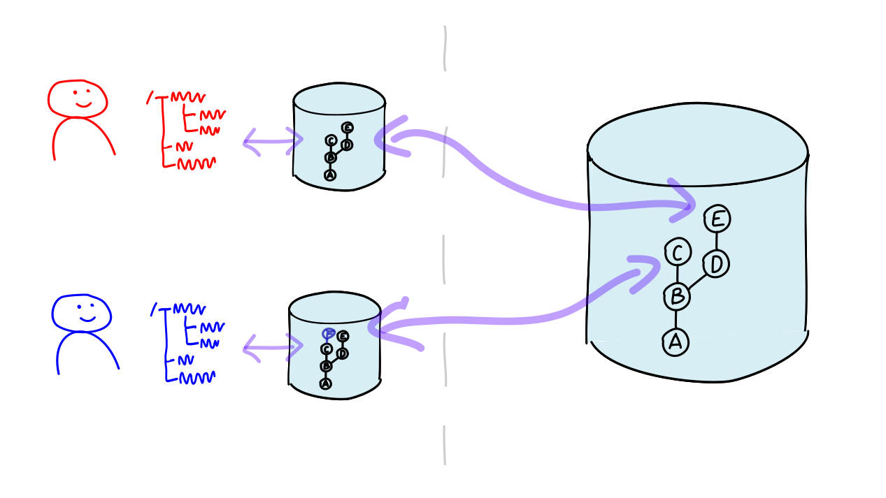

### Lernziel (Befehle)

```bash
    # Commits erstellen
    git clone <repo-url>

    # Remote-Adressen verwalten
    git remote add <name> <repo-url>
    git remote -v

    # Synchronisieren
    git fetch
    git pull
    git push
```


---

## Zentral vs. Dezentral


---

Zentral




---

Dezentral: Lokale Commits, lokale Historie




---


Dezentral: Austausch geht auch ohne zentralen Server.


---

## Zentrale Versionsverwaltungen

 * Entwickler-Workspaces enthalten nur die aktuelle Version.
 * Zentrales Repository enthält historische Informationen und verwaltet
Branches und Tags.
 * Alle Commits und Updates erfordern den Zugriff auf einen zentralen Server.


---

## Dezentrale Versionsverwaltungen

 * Jeder Entwickler hat einen Workspace und ein vollständiges Repository
 * Commits werden nur lokal durchgeführt.
 * Zwischen Repositories können Commits mit Pull und Push ausgetauscht
werden.
 * Einzelne Repositories können als „besonders“ definiert werden und
halten den offiziellen Stand („Blessed Repository“).


---

## Vorteile

 * Hohe Performance
  Die meisten Operationen finden lokal auf dem Rechner des Entwicklers statt.
 * Offline Fähigkeit
   Commits, Branches, Tags können auch ohneSerververbindung durchgeführt werden.
 * Effiziente Arbeitsweisen
   Lokale Branches und Tags erleichtern den Entwickler-Alltag.
 * Automatische Backups
   Jedes Repository ist gleichzeitig auch ein Backup des gesamten Projektes, inklusive Historie.

---

### Klonen

Mit dem clone-Befehl können Repositorys geklont werden.
Dabei werden alle Objekte (Blobs, Commits, Branches, Tags) kopiert.
Ein Workspace wird mit dem `HEAD`-Stand initialisiert.

```
$ git clone https://<server>/<pfad>/git-training-protocol.git
```


---

## Repository URLs

Geben an, wo ein Git-Repository liegt.

```
myrepos/sample                    # Lokaler Pfad zum Repo
myrepos/sample.git                # Lokaler Pfad zu bare Repo

ssh://ich@meinserver/sample.git   # SSH
ich@meinserver:sample.git         # auch SSH

https://ich@meinserver/sample.git # HTTPS
```


Notes:

Es gibt noch mehr Möglichkeiten.


---


### Klonen

Mit dem clone-Befehl können Repositorys geklont werden. Dabei werden alle
Objekte (Blobs, Commits, Branches, Tags) kopiert.

```
$ git clone https://<server>/<pfad>/git-training-protocol.git
```

---

### Klonen - Bare Repository

 * Bare-Repository: `clone --bare` erzeugt ein Repository ohne Workspace

---


### Klonen - Performance

 * Lokale Klone (schnell)
 * Tipp: `--reference` (Schneller klonen bei großen Repos)


---

### Übung: Klonen

Starten sie im *Übungsverzeichnis* (wo sie das Zip-Archiv mit den
Übungen entpackt haben).
Öffnen sie die Anleitung im *Browser* (mit dem Kommando `start` auf
Windows, `xdg-open` auf Ubuntu,`open` auf MacOs).
**Achtung!** Es ist wichtig, die Übungen im *angegebenen
Startverzeichnis* zu beginnen. Achten Sie auf die Beschreibung:

    $ cd git-uebungen-<Zeitstempel z. B. 202005252000>
    $ start aufgaben/XX-klone-klonen/index.html
    $ cd aufgaben/<angegebenes Startverzeichnis>

Folgen Sie dann den weiteren Anweisungen.

---

## Remote Repositories

Anzeigen, woher geklont wurde (`origin`)

```bash
git remote -v

git remote add mein-backup /backup/sample-repo.git
```


---

### Erinnerung: Ref - Zeiger auf ein Commit

Branches sind Zeiger auf Commits, z. B. `myfeature`, `master`


---

### Remote Refs

*Remote Refs* repräsentieren den Stand der *Refs*, insbesondere Branches,
im einem anderen Repository beim Klonen bzw. der letzen Synchronisation).

```bash
git show master               # lokaler Stand
git show origin/master        # origin nach letztem Synch
```


---

### Remote Refs - Ahead/Behind

*Remote Refs* ermöglichen, lokale Stände mit fernen Repository zu vergleichen.

```bash
    $ git status

    On branch master
    Your branch is ahead of 'origin/master' by 1 commits.

    $ git diff master origin/master

    $ git log origin/master..master   # ahead
    $ git log master..origin/master   # behind
```

