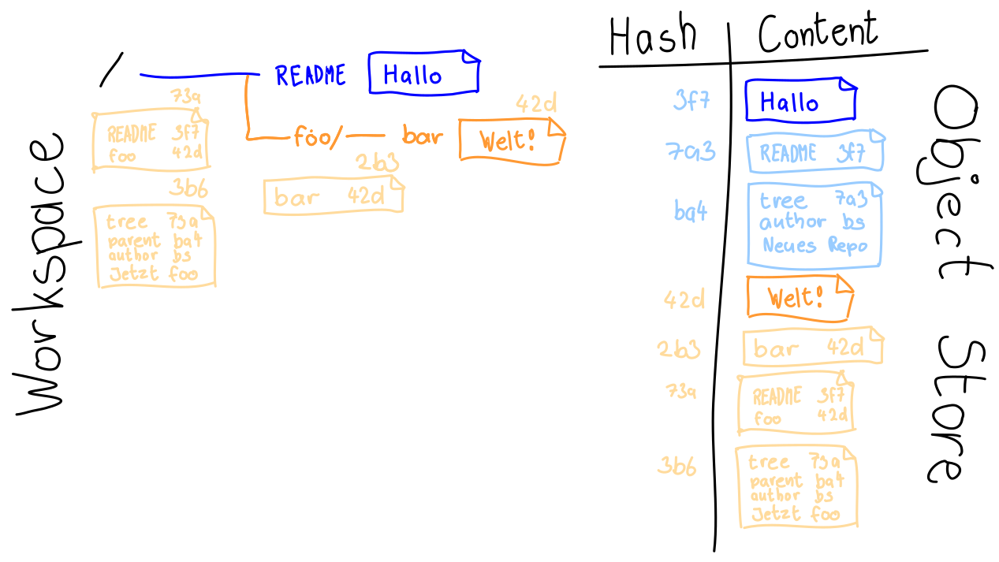

# Anatomy of a Commit

---


```bash
$ git init
$ vim README
$ git add README
$ git commit -m "New Repo"
```

---


[Download](commits-im-object-store.svg)

---

```bash
$ mkdir foo
$ vim foo/bar
$ git add foo/bar
$ git commit -m "Now foo"
```

---


[Download](commits-im-object-store.svg)

---

How does Git store commits?

---

```
$ git init
$ vim README
$ git add README
$ git commit -m "New Repo"

$ git show HEAD
$ git show HEAD:hello         
$ git ls-tree -r HEAD
```


---


### Everything has a (SHA1-) Hash!


---


## Git has a database:


## The Object Store

---




---

The heart of Git is the so-called **Object Store**,
a database where

* Contents of files (**Blob**)
* Directories (**Tree**)\
  Listings of files
* **Commits**\
  including metadata

are stored.


---


### Inspect the Object Store

* `.git/objects`
* Keys are SHA1 hashes
* Contents are zlib-compressed
  ```bash
   $ cat 752c104f5f515c0f3b93bd21351f9e1add7e6a | pigz -d
  ```
* Git plumbing commands:

   ```bash
   $ git cat-file -t HEAD   # type
   $ git cat-file -s HEAD   # size
   $ git cat-file -p HEAD   # print
   ```

---

### Important Object Types

* `blob`
* `tree`
* `commit`


Identical contents are stored only once.


---


### Writing to the Object Store

```bash
$ echo 'test content' | git hash-object -w --stdin
``` 

---

What exactly is contained in a commit?

    git log --pretty=raw

In particular, (Posix) permissions are included, but not timestamps.


