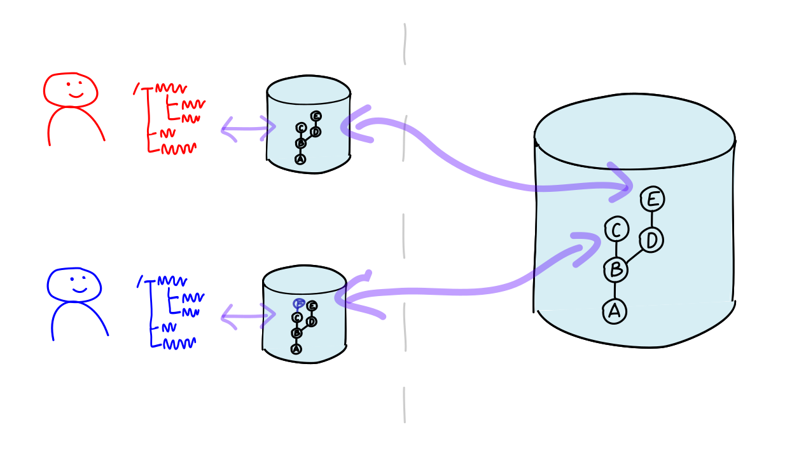

#### Architects Corner

## Decentralized

---

## Not Git 

Centralized Repository

---

### Centralized Version Control Systems

 * A central repository contains history and manages
branches and tags.
 * All versioning operations require access to the central server.
 * Decentralized here are only the workspaces with the working files.

---

### It is said: *"Git is decentralized"*.   What does that mean?

Work is done on *copies* of the repository, called **clones**.

The entire history is available *locally*.
All versioning operations are performed locally.

---

## Git

Decentralized Exchange

---

### Git has *no* Client/Server Architecture,

It consists of *command-line commands* (CLI)
that manipulate the repository (stored locally as files in the `.git` directory).

---

## The Magic of Git

Git can determine differences between clones (delta)
and transfer the changes: `push`, `pull`, `clone`, and `fetch`.

---

### Git is decentralized, **but**

Projects often still use a *blessed repository* as the source of truth.

---

### Advantages: Decentralized Repositories

 * High **performance**: 
   Most operations take place locally on the developer's machine.
 * **Offline** capability: 
   Commits, branches, tags can be performed without a server connection.
 * **Efficient** workflows:
   Local branches and tags make developers' lives easier.
 * Implicit **backup**:
   Every repository is also a backup of the entire project, including history.

