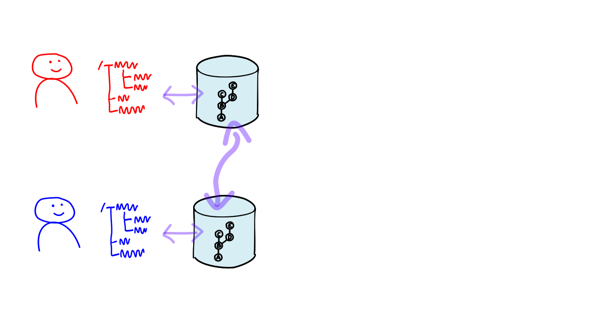

#### Architects Corner

## Dezentral

---

## Nicht Git 

---

### Zentrale Versionsverwaltungen

 * Ein zentrales Repository enthält Historie und verwaltet
Branches und Tags.
 * Alle Versionieirungsoperationen erfordern Zugriff auf den zentralen Server.
 * dezentral sind hier nur die Workspaces mit den Arbeitsdateien

---

### Es heisst: *"Git ist dezentral"*.   Was ist damit gemeint?

Es wird auf *Kopien* des Repositorys, genannt **Klon**, gearbeitet.

Die gesamte Historie liegt *lokal* vor.
Alle Versionierungsoperationen erfolgen lokal.

---

### Git hat *keine* Client/Server-Architektur,

Es besteht aus *Kommandozeilenbefehlen* (CLI)
die das Repository (lokal abgelegt als Dateien im `.git`-Verzeichnis)
bearbeiten.

## The magic of Git

Git kann Unterschiede zwischen Klonen ermitteln (Delta)
und die Änderungen übertragen: `push`, `pull`, `clone`, und`fetch`.

---

## Dezentraler Austausch

---

Projekte nutzen dennoch oft ein *blessed Repository* als Hort der Wahrheit.

---

### Vorteile: dezentrale Repositorys

 * Hohe **Performance**: 
  Die meisten Operationen finden lokal auf dem Rechner des Entwicklers statt.
 * **Offline** Fähigkeit: 
   Commits, Branches, Tags können auch ohneSerververbindung durchgeführt werden.
 * **Effiziente** Arbeitsweisen:
   Lokale Branches und Tags erleichtern den Entwickler-Alltag.
 * Implizites **Backup**:
   Jedes Repository ist gleichzeitig auch ein Backup des gesamten Projektes, inklusive Historie.

