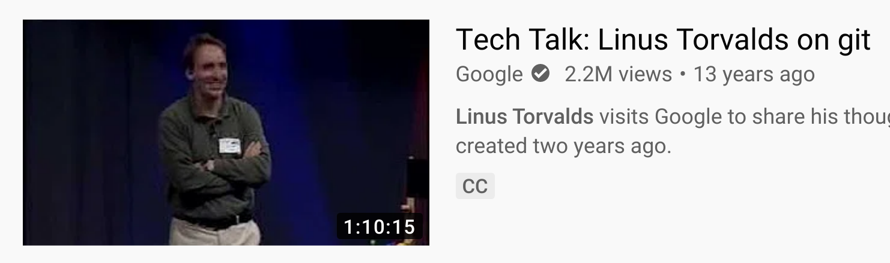
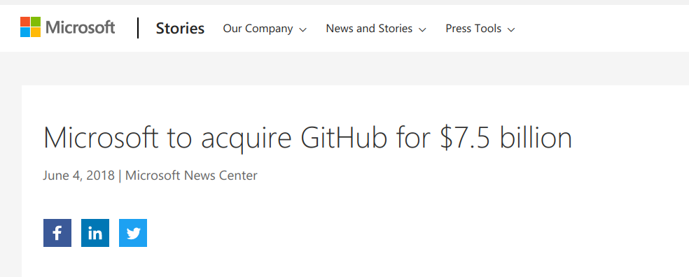

#### Architects Corner

## Origin

---

The **Linux kernel** was manually versioned for a long time (*Tarballs & Patches*),
by **Linus Torvalds**.

Later, a commercial version control system called Bitkeeper was used.

*For reasons*, Torvalds had to find an alternative starting in 2005.

---

It had to be open-source. But **CSV** and
**Subversion** did not appeal to him.

> Subversion used to say it is CVS done right:
> with that slogan there is nowhere you can go.
>
> There is no way to do CVS right.

(Linus Torvalds, May 2007)

---

[Watch it on YouTube](https://www.youtube.com/watch?v=4XpnKHJAok8)

[Git Website](https://git-scm.com/)

---

... and so Git was born:

### The Developers

 * Junio C. Hamano
 * Shawn O. Pearce
 * Linus Torvalds
 * and others.

*Source: [Git on de.wikipedia.org](https://de.wikipedia.org/wiki/Git)*

---

The requirements for a source code repository arose from the needs of the kernel community:

 * **Parallel development** (1,000+ contributors)
 * **Security and traceability**
 * **Linux style** for kernel developers

---

### Parallel Development

<table>
  <tr>
    <th>Challenge</th>
    <th>Solution</th>
  </tr>
  <tr>
    <td>
      <ul>
        <li>Small patches and large features,</li>
        <li>many developers (1,000+),</li>
        <li>little coordination</li>
        <li>hard to manage centrally</li>
      </ul>
    </td>
    <td>
      <ul>
        <li>Clones: Decentralized work 
      on independent repository copies</li>
        <li>Push/Pull operations 
        identify and transfer differences
        retroactively 
        from clone to clone</li>
      </ul>
    </td>
  </tr>
</table>
 

---

### Security

<table>
  <tr>
    <th>Challenge</th>
    <th>Solution</th>
  </tr>
  <tr>
    <td>
        Who is allowed to make changes?
    </td>
    <td>
      Write access only for maintainers. 
      Developers work on clones, 
      offer changes for retrieval. 
      ➔ Pull Request
    </td>
  </tr>
  <tr>
    <td>
        Traceability
    </td>
    <td>
      SHA1 checksum on all content 
      Digital signing capability
    </td>
  </tr>
</table>

---

### *Linux Style* for Kernel Developers

 * Few dependencies, "installable everywhere"
 * Highly performant* 
   filesystem-optimized (Write-once)
 * Stable command-line commands facilitate automation

\* *for projects with many source code files*

---

# Git

  * Decentralized: Clones, Push, and Pull
  * Robust and simple branching and merging
  * Performs well, even with a lot of source code
  * Very flexible workflow
  * Exchange between repositories (Push/Pull)
  * Open-source
  * Quasi-standard  

---

Obviously, Git was not only a good thing for kernel development but also interesting for others:

