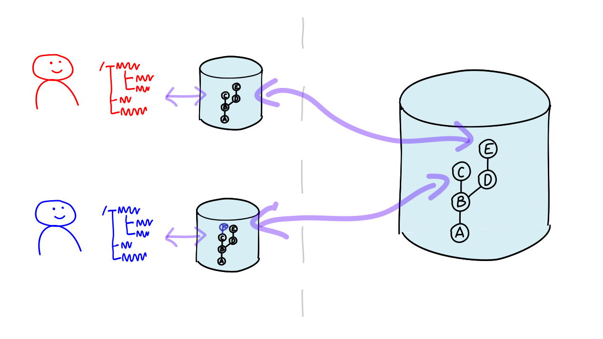

## Architecture of Git

---

Centralized

---

Decentralized

Git can transfer deltas between repositories (`push`/`pull`/`fetch`).

---

Decentralized, with a *blessed repo*.

---

### Git

 * has *no* client/server architecture,
 * consists of command-line commands (*CLI*),
 * stores data in files and directories
   (*Object Store*).

---

## How to Make Software Extensible?

---

Git relies on [Porcelain & Plumbing](https://git-scm.com/book/en/v2/Git-Internals-Plumbing-and-Porcelain), instead of plugins.

---

* `plumbing`
  - fundamental
  - read/edit data structures
* `porcelain`
  - user-friendly, powerful
  - e.g., `log`, `commit`, `merge`, ... 
  - based on `plumbing`
* even `plumbing` is 
  - standardized
  - enables extensions

---

## Can Software Have an Opinion?

---

## Git 

 * is not *opinionated*,
 * offers a variety of commands,
 * enables different workflows and ways of working.

---

## Backward Compatibility

The Git community places great emphasis on **backward compatibility**.

This facilitates scripting/automation on the one hand.

On the other hand, *old baggage* cannot be discarded.

---

 * **decentralized** \
   No server/service/daemon. \
   Only commands that work with files.
 * **CLI** + file structures
 * **"Porcelain & Plumbing"**
   - Plumbing: "Raw" commands, file formats
   - Porcelain: User-friendly end-user commands
 * not **opinionated** \
   supports various workflows \
   without preference for the *right workflow*
 * **Backward Compatibility**
