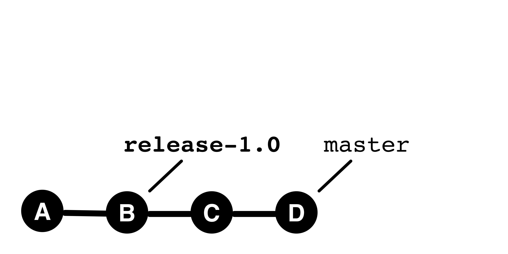
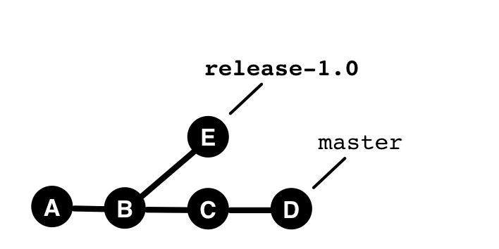

### Learning Objective (Commands)

```bash
    # Create branches
    git branch my-new-branch

    # Switch branches
    git switch old-branch
    git switch -c my-new-branch

```

---


**Branches** allow you to maintain **parallel development lines**

within **a single repository**,

and freely **switch between them**.

Notes:

More precisely: only within a clone of a repository.

You can also open multiple development lines
by creating clones in different directories.
In this case, the management of the lines
is outside of Git.
You have to remember where each line is stored.
With branches, you give the lines names and can
list, compare, and manage them.


---

### Branches are Pointers to Commits



#### One branch is active (here `release-1.0`)

---

#### New commits go to the active branch




---

### Creating a Branch

```bash
    # A branch is a pointer to a commit
    git branch new-branch2 38a8efc72

    # If nothing is specified, HEAD is taken
    git branch new-branch
```

### Showing Branches

```bash
    git branch -vv
```


Notes:

`-v`, `-vv` ensure that more details are displayed.


---

## Switching Branches

Every repository has an **active branch**.

```
    git switch new-branch
```

```
    git switch -c new-branch
```

Deprecated but still usable, `git checkout`

```
    git checkout -b new-branch
```


Notes:

When using worktrees, there is one active branch per worktree.

---

## Properties of Branches

 * Movable pointer to a commit.
 * (At most) one branch is *active*
   - checkout switches the active branch
 * When committing, the active branch is advanced.
 * Branches are local

---

### `log` and `diff` in Branching

These commands allow *asymmetric* comparisons:

What have we changed? What have others changed?

```bash
$ # What have THEY changed? 
$ git log <our-branch>..<their-branch>    
$ git diff <our-branch>...<their-branch>    

$ # What have WE changed? 
$ git log <their-branch>..<our-branch>    
$ git diff <their-branch>...<our-branch>   
```

---

### Command: `git merge`

Combine changes.

```bash
$ git merge <other-branch>
```

integrates the changes from `other-branch` into the active branch and creates a new commit for it.

*Note:* A separate chapter on *merges* will follow later, covering conflict handling and special cases.

---

<iframe src="markdown-git-uebungen/aufgabe-zusammenarbeit-branching.html" width="100%" height="600px" ></iframe>


