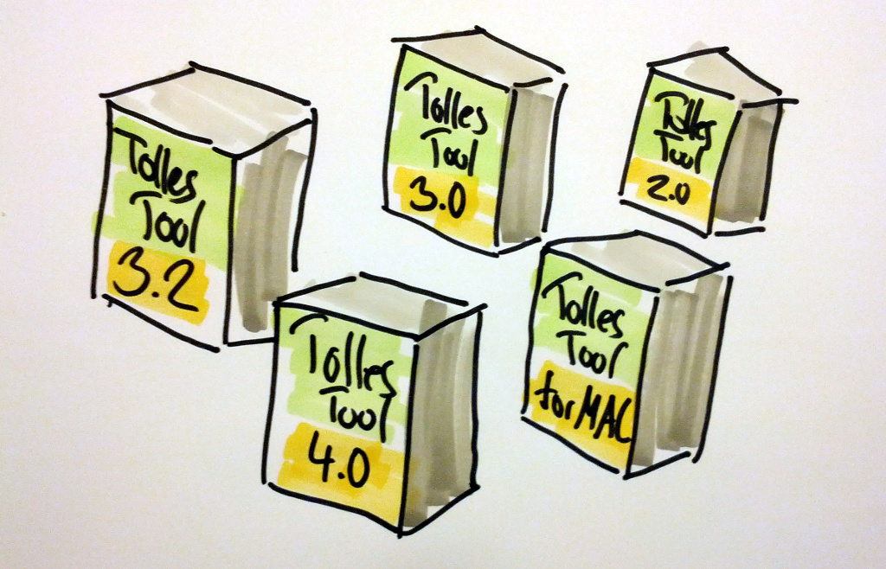

# Why 

# Branching?

---

#### Ring ... Rrring ... Rrrrring

*(Team Lead)*: Hello?

*(Boss)*: This bug with the encoding. It needs to be fixed.

*(Team Lead)*: How about saying "Hello" first?

*(Boss)*: By 3 PM tomorrow, at the latest!

*(Team Lead)*: Uh, that's going to be a bit tricky, we've already started developing for the next release...

*(Boss)*: One more thing: The recording feature must not be in the release. Privacy concerns, you know.

*(Boss hangs up)*

---

In which versions is BUG-4711 fixed?

---

## Continuous Delivery: Releasing multiple times a day. Isn't that REALLY DANGEROUS?

---

Wishes
=======

 * Control over **parallel development** 
   of features and bug fixes
 * For **multiple releases** 
   clarity about variants and bug fixes.
 * **Continuous Delivery** 
   safety even with frequent releases
