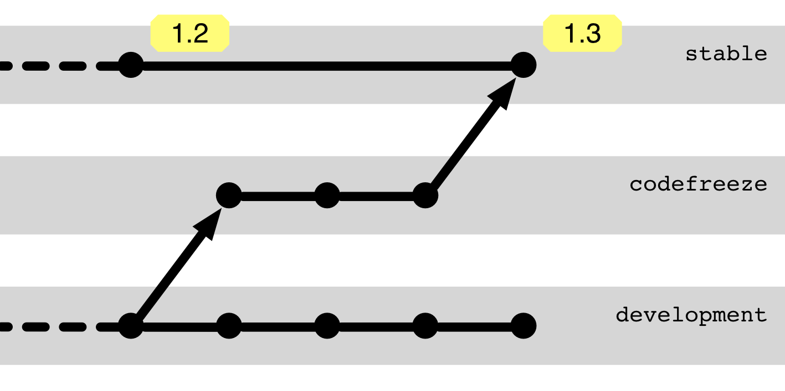

# Patterns 

## für Workflows

---

## Staging-Branches

---

## Staging-Branches

Repräsentiert ein Qualitätsniveau, z. B.

 * `develop`: Build-fähig, darf unfertige Features zeigen.
 * `release`: Fertige Features, noch nicht abgenommen
 * `master`: Abgenommene Version für Kunden

---

## Merge-Ketten

Merge-Ketten gehen von älteren (upstream) Branches zu neueren Branches.

Durch Merges werden alle Änderungen von einem Branch zum nächsten übertragen.

---

## Backporting

In die andere Richtung,
will man nicht alle Änderungen mitnehmen.

Selektive Übernahme einzelner Änderungen,
z. B. durch Cherry-Pick.

Entkoppelt Releases.

Management erforderlich: Was wurde wo angewandt?

