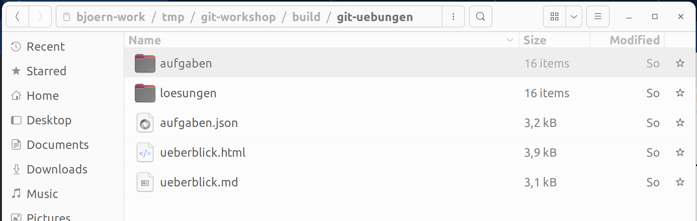

### The Git Command Line

---

If not already done:

[Install Git](/git-workshop/installation/git)

---

## Terminal/Shell

A terminal/shell window is required for the exercises

 * Linux/Mac: Open "Terminal"
 * Windows: Open "Git-Bash"

Tip: You can also use other shells, e.g., PowerShell or zsh.
Exercises and sample solutions were tested and recorded in the Bash shell.

---

[Tips for working with the command line](/git-workshop/installation/kommandozeile)

---

## Git Commands

```
    git <sub-command> <options> <arguments>
```

For example:
```bash
    $ git commit -a -m "Hello World!"

    $ git version
    git version 2.37.3
```

---

## Help and Information about Git

 ```
 $ git
 $ git --version
 $ git help
 $ git help log
 $ git help --all
 $ git help --guides
 $ git help revisions
 ```

---

### Command: `git config`

```bash
  $ git config user.name               # Display configuration
  bjoern

  $ git config --global user.name      # Change configuration
```

[Configure Git](/git-workshop/installation/konfigurieren)

---

Configuration recommendations for this workshop:

```bash
    $ git config --global user.email <Your-Email>
    $ git config --global user.name <Your-Name>
    $ git config --global pull.rebase false 
    $ git config --global merge.conflictStyle diff3
```

---

[Download and extract exercises](/git-workshop/installation/uebungen)



---

<iframe src="markdown-git-uebungen/aufgabe-intro-commandline.html" width="100%" height="600px" ></iframe>
