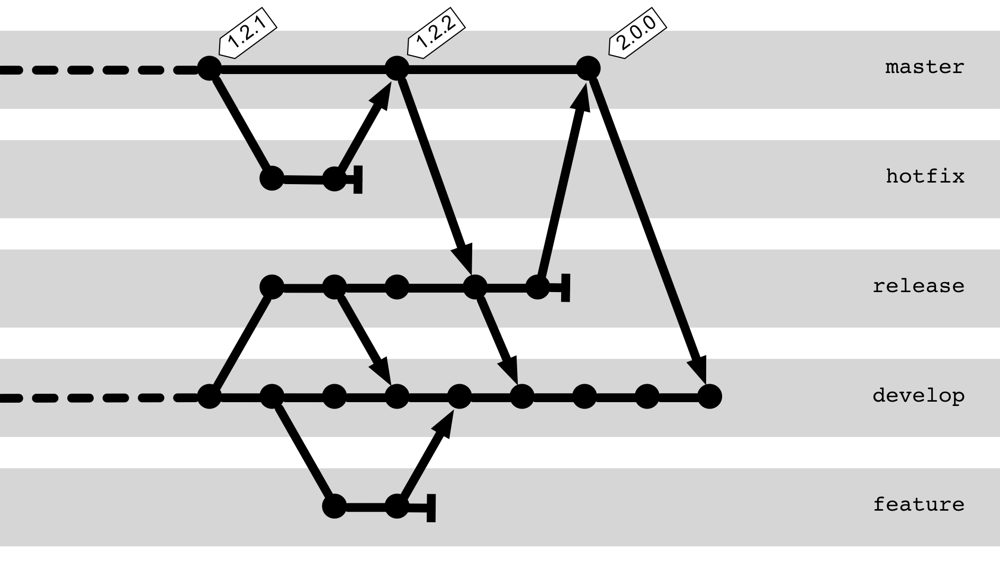
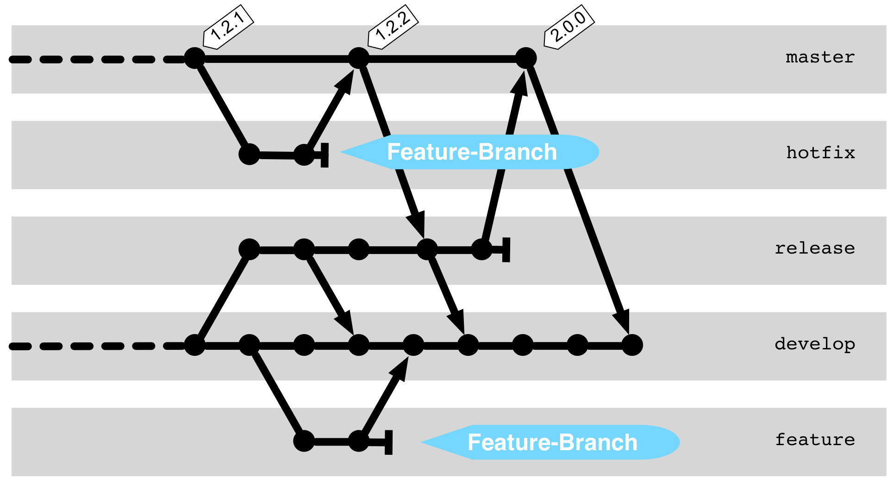
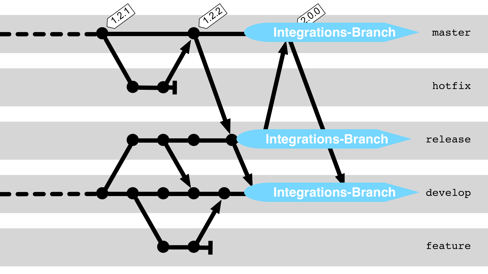
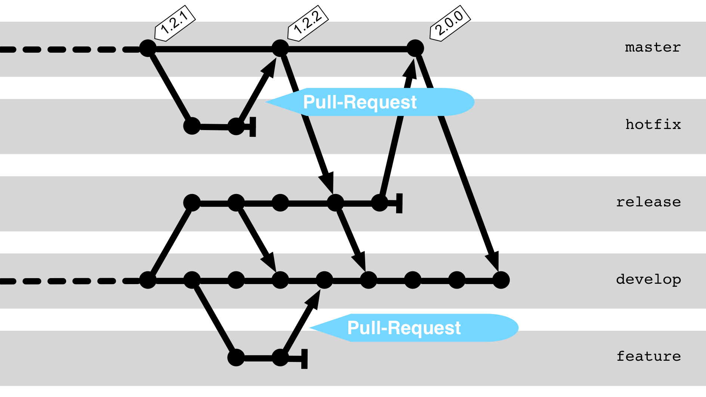
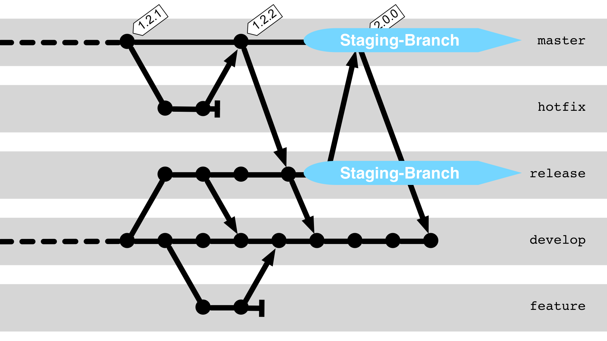
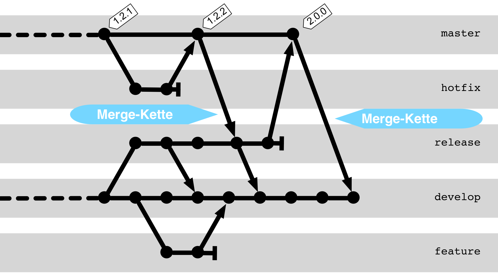
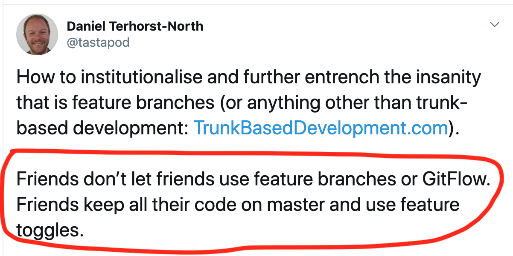

# Gitflow

---

Gitflow
-------

---

Gitflow: Feature-Branch
------------------------

---

Gitflow: Integration Branch
-----------------------------

---

Gitflow: Pull Request
-----------------------------

---

Gitflow: Staging Branch
-----------------------------

---

Gitflow: Merge Chain
-----------------------------

---

Backports
---------

 * Cherry-pick to copy the bugfix.

---

