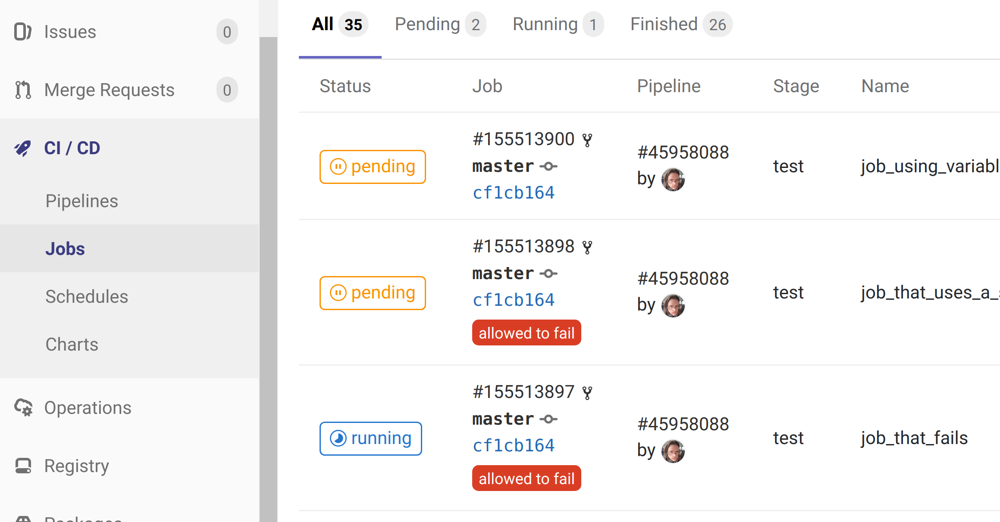

# **Jobs**

---

## Learning Goal

 * `.gitlab-ci.yml`
 * What is a GitLab job?
 * How to configure a job?

---

### ` .gitlab-ci.yml`

 * Describes the pipeline.
 * Consists of jobs\
   that build, test, deploy the project, etc.
 * As soon as a commit arrives*\
   GitLab executes the pipeline.
 * [Beginner tips for YAML syntax](https://github.com/Animosity/CraftIRC/wiki/Complete-idiot's-introduction-to-yaml)

Notes:

*: Other start conditions can be configured.

---

---

## Job

A job performs its work in the form of command-line commands:

https://gitlab.com/gitlab-ci-samples/basic-job

---

## Job - Options and Environment

There are numerous ways to control whether, when, where, and how the commands are executed.

 * [Documentation for `.gitlab-ci.yml`](https://docs.gitlab.com/ee/ci/yaml/)

 * https://gitlab.com/gitlab-ci-samples/job-options

Numerous predefined variables provide access to the context:

https://docs.gitlab.com/ee/ci/variables/

