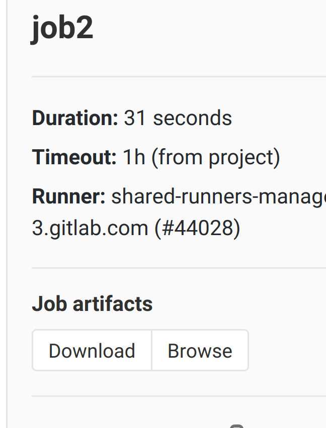

# **GitLab Pipelines**

<!-- .slide: data-background-image="gitlab-ci-pipelines/pipelines.png" data-background-opacity="0.4" -->

---

## Learning Goal

 * What is a **pipeline**?
 * **Stages**
 * **Caches**
 * **Artifacts**

---

### Job Artifacts

