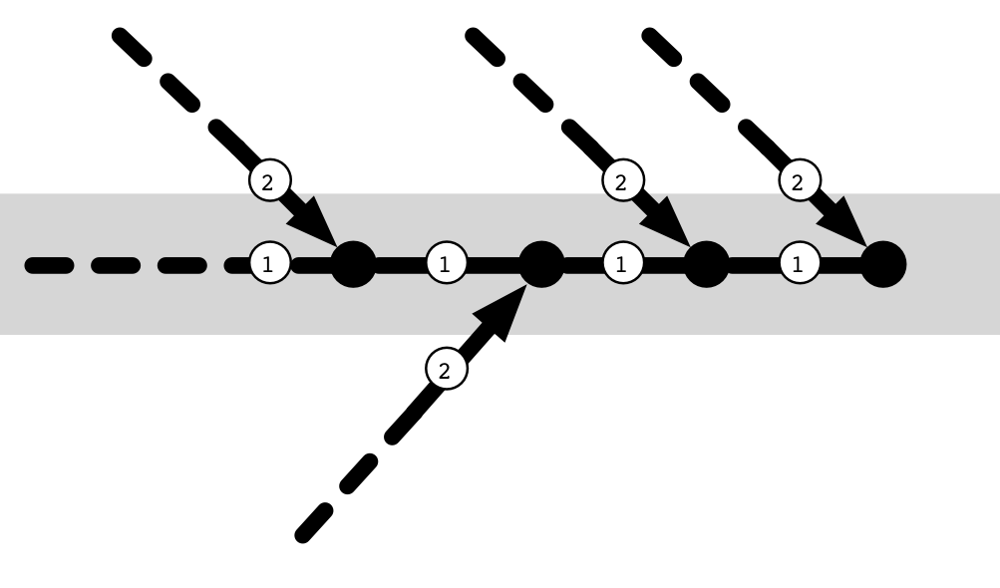

## Integrations-Branch

---

### Integrations-Branch

 * Integriert nur Änderungen anderer Branches.
 * Keine direkte Entwicklung auf diesem Branch.
 * Enthält nur **Merges**.
 * **1st-Parent-History** zeigt die Folge der  Integrationen 
   z. B. "Feature 1", "Bugfix 1", "Feature 2"

