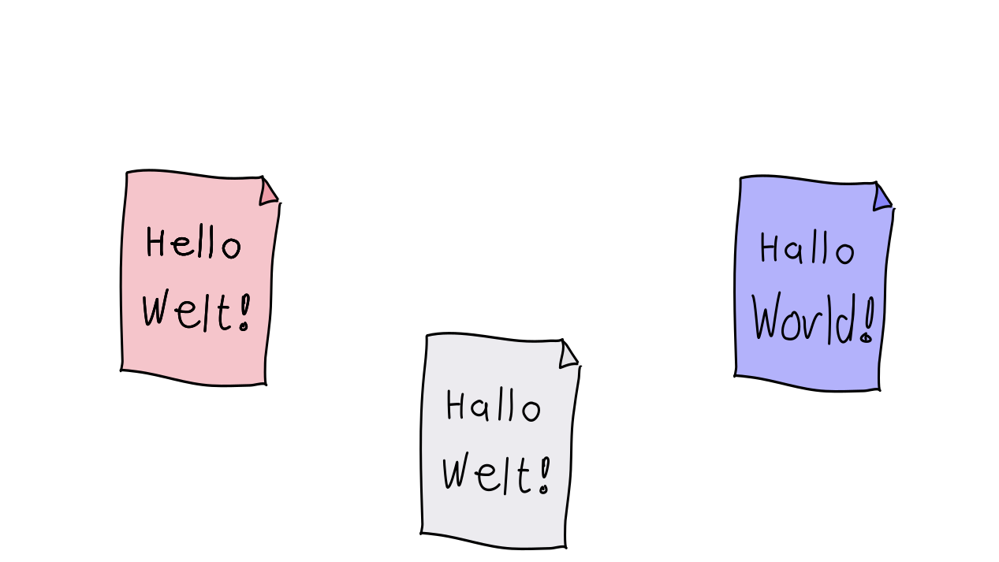
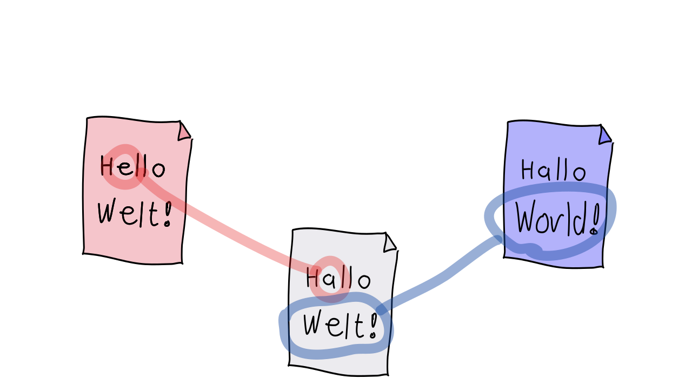
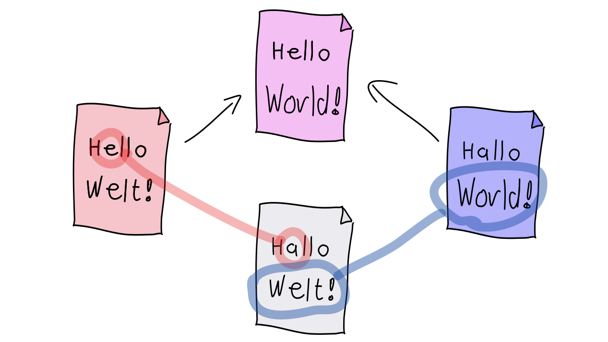
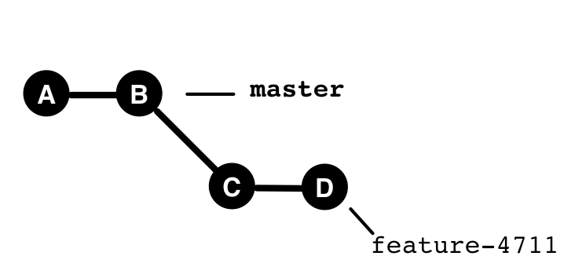
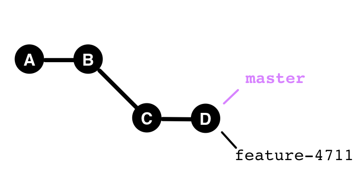
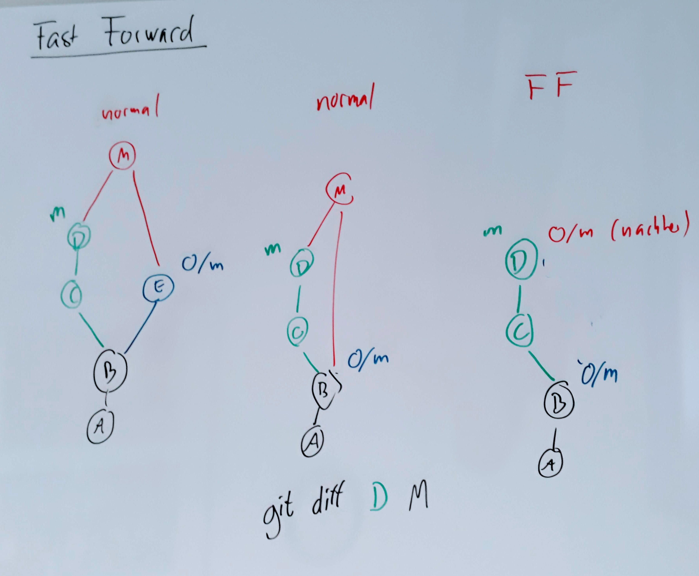
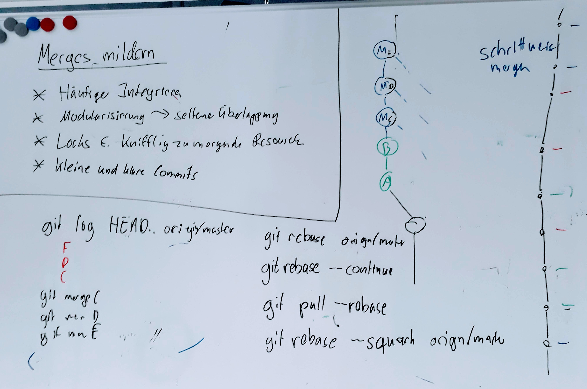

## How do branches arise?

---

### How do branches arise in the commit graph?

 1. Two developers A and B clone a repository
 1. Both create a commit
    (with the same predecessor)
 1. B pushes first (and wins!)
 1. A tries to push, but ...

---


---

### Merge

    git fetch

    git merge origin/master

---

## 3-Way Merge


---


---





---





---





---

### Properties of Merge

A merge usually results in a commit:

 * Commit has 2 parents (at least)
 * 3-Way Merge
   * All changes since the common ancestor are merged
   * Text sections (hunks) are added, changed, or deleted.
   * No guarantee that changes fit together!
 * The merge commit can be freely edited (`--no-commit`, then manual commit)


---


## Changes 

### Automatically merged
 
 * Different files
 * Different line ranges within a file

### Reported as conflict

 * Same line ranges within a file


---


```bash
   $ git status
``` 
shows which files are affected.

```
  Unmerged paths:
    (use "git add <file>..." to mark resolution)
          both modified:   average.kts
```

---


In the affected files, conflict markers are present.


```
  <<<<<<< HEAD
  val summe = args.map{ it.toInt() }.sum()
  ||||||| d19e196
  val s = args.map{ it.toInt() }.sum()
  =======
  val s = args.map{ it.toDouble() }.sum()
  >>>>>>> 04781863ba5f6ffe3303c84d463546043a932e5
```
*(Exception: Binary files)*

---

## Resolving Conflicts

1. `git status` shows conflict files
1. For each conflict file
   1. Open the file, locate conflict markers
   1. Manually merge lines
   1. Remove conflict markers
   1. Confirm with `git add <file>`
1. Complete with `git commit`

## Alternative

```bash
 $ git mergetool
```

---

### Merge and Diff

The "Tuning Fork"

    git diff HEAD^1
    git diff HEAD^2

Which diff I see depends on where I look.


### Merge - Fast Forward


If nothing has changed on one side of the merge, Git usually performs a *fast-forward*:

---




---




---




---


    git merge --no-ff

    git merge --ff-only

 `fast-forward` 34


---

### Merge - Conflict

       - `config --global merge.conflictStyle diff3`
       - Conflicts 41
       - `checkout` 38
       - `--ours`, `--theirs` 32
       - `merge --abort`
       - `mergetool` 32

`merge` 29,30,31,43,44


---

<iframe src="markdown-git-uebungen/aufgabe-zusammenarbeit-integration-von-aenderungen.html" width="100%" height="600px" ></iframe>

---

> L'enfer c'est les autres. 

*Jean-Paul Sartre*

---


**Merge Conflicts** can be exhausting. What can be done to

### avoid them?

### make them less severe?

### resolve them more easily?


---


 * Clear modularization, architecture
 * Coordination (Who does what?)
 * Frequent integration
 * Step back, analyze changes, recognize intent
 * Communication in advance, or ask authors
 * Commit comments
 * Gradual merging
 * Fine-grained commits
 * Good merge tools


---




---


[Renames and Merges](renames-und-merges.md)


---

### Summary (Commands)

```bash
  git log --all --graph

  git merge

  git mergetool

  git log branchA..branchB
  git log HEAD^1..HEAD^2
```


