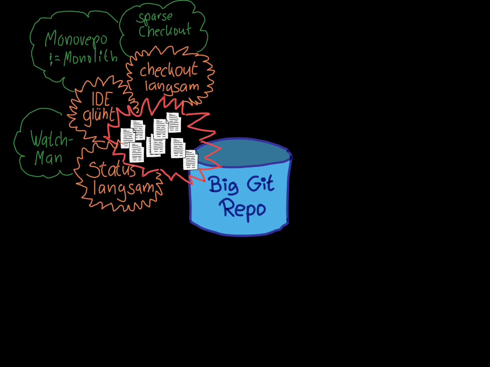
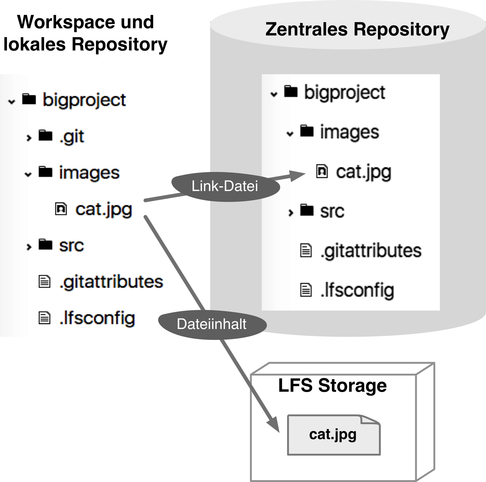
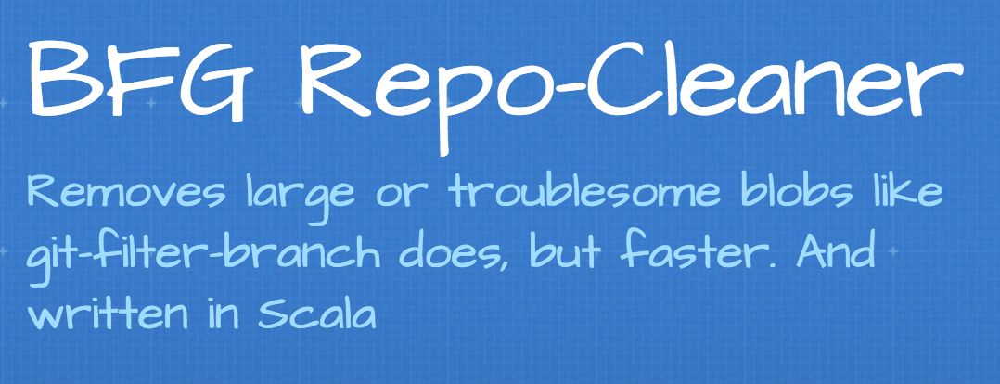
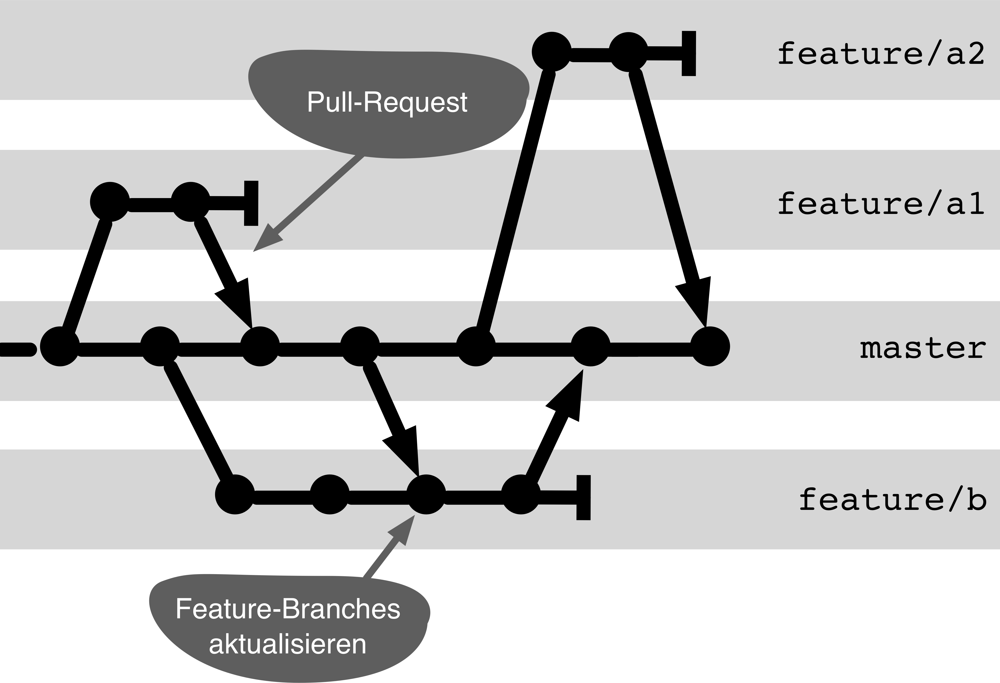
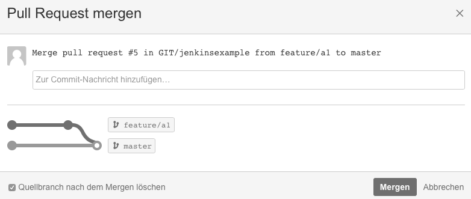
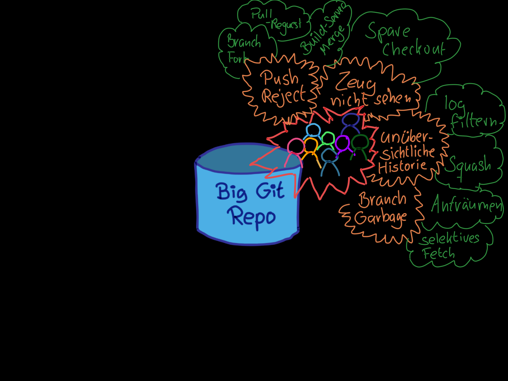
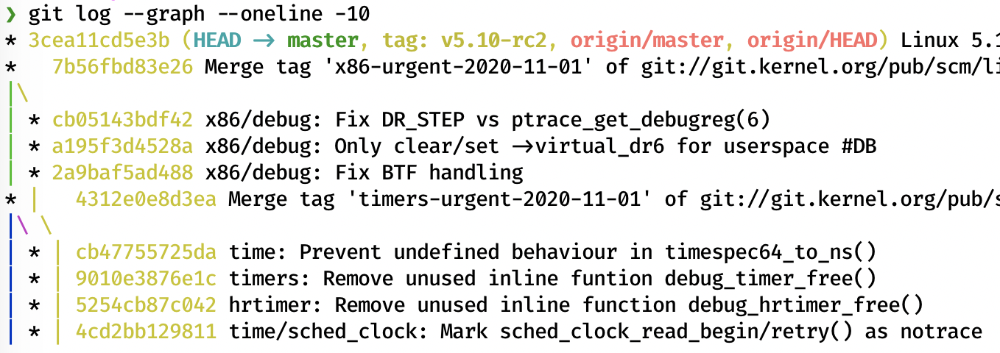
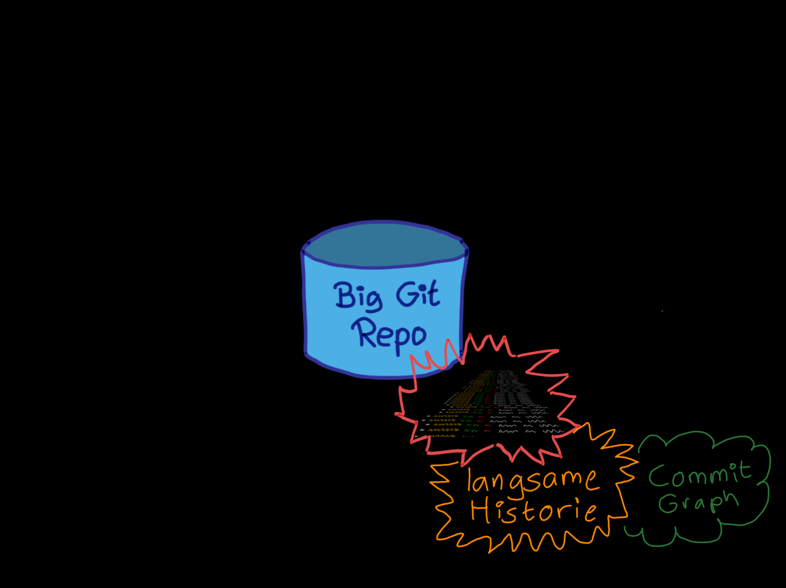
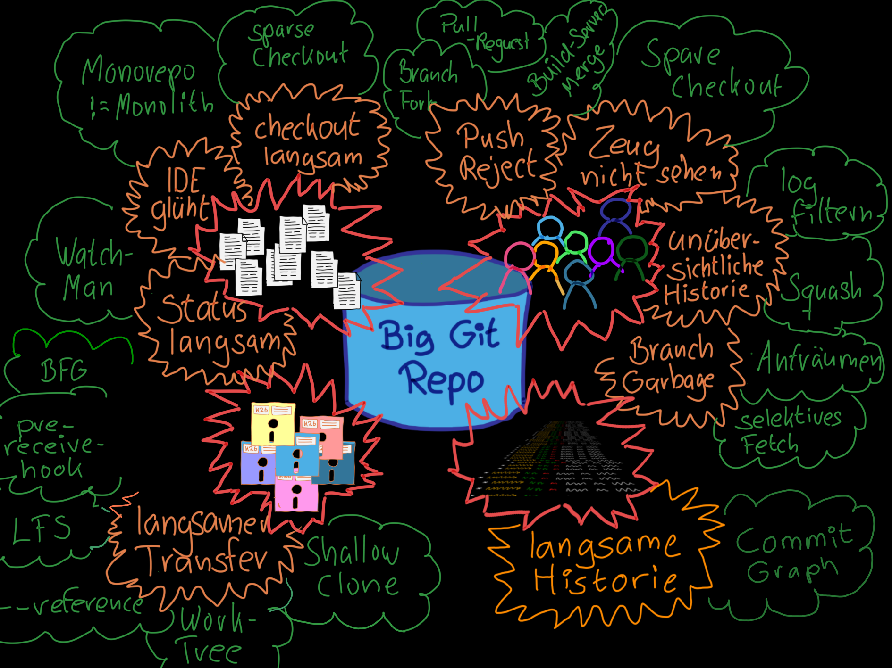

<!-- .slide: data-background-image="sections/monorepo/monorepo.png" -->


# MONOREPO TODO


---


### How many
 
Dev Teams   
Files  
Lines of Code  
# **?**

notes:

Estimate!

across your **entire company**

Dev Teams: Who has more than 2, 5, 10, 20, 50, 100, 500 

Files: Who has more than 1,000, 10,000, 500,000, 1,000,000

Lines of Code: Who has more than 100,000, 1 million, 10 million, 100 million 


---

# Think Big! <br/><br/><br/><br/>

<!-- .slide: data-background-image="sections/monorepo/tyranno-watching.png" -->


---

A small thought experiment:

## Put all of this into
# **1 Repo**!


---

... too big 
... too slow 
... bureaucratic
... constant conflicts 
... and where is the team autonomy   
... completely unagile
... why should I care about stuff from other departments
... centralistic
... every clone takes forever
...


---

but some do it, e.g.

 * Google
 * Facebook
 * Microsoft
 * Twitter

### Are they completely crazy?


---


A **Monorepo** supports

 * Large Scale **Refactorings**
 * **API** Migrations
 * **Analyses** \
   Vulnerability, Defects, Usage, Data Lineage
 * **Cleaning up**

notes:

 * Switching to major releases of C++, PHP
 * When can I turn off an API?
 * Not all big ones do it: Amazon, Netflix

---
## Prerequisites

 1. **1** Repo for Everything™
 2. Trunk Based Development
 3. Commitment to stability of `main`   
 4. Scalable build pipeline 

> Google is versioned!


notes:

Requires:

 1. Technology, investment, and team.
 2. Only the `main` state is relevant 
 3. Requires maturity in governance.
 3. Tooling (e.g., Bazel).


---

<div style = "font-family: 'Times New Roman';">

> QUOD LICET JOVI \
> NON LICET BOVI

</div>

The giants may and can do it. \
Should we, the dwarfs, follow suit?

notes:

We leave this question open.


---

## Monorepo

| **👎**   | **👍**                      |
|:-------------:|:-------------:|
| High investment in<br/>infrastructure + team   | Large scale refactoring |
| Governance maturity<br/>required   | Cross-cutting analyses |
| Central<br/>dependency           | Housekeeping (APIs/Code) |

notes:

Tricky decision, because \
short-term investment is high, \
benefits lie in long-term aspects.


---


<!-- .slide: data-background-image="sections/monorepo/gross.png" -->


If you build a monorepo,  
you will get a large repo,

## but what does

# LARGE

actually mean?


---


### Dimensions of "large"

 * Many files
 * Many bytes
 * Many people
 * Many changes


---


Each dimension has its own challenges.


---


===

<!-- .slide: data-background-image="sections/monorepo/viele-dateien.png" -->

## Many Files!<br/><br/><br/>


---


## Many Files - Problems


 * `checkout` slow!
 * IDE overheats!
 * `status` slow!


notes:

 * Filesystem performance during initial checkout and branch switching
   - `checkout` and other commands that manipulate the workspace.
 * IDE performance with many open projects
 * Git performance with the status command


---


#### Many Files - `checkout` slow!

### Solution: Sparse Checkout

Filter which files\
are fetched into the workspace.

notes:

 * `git clone` with  `--sparse` \
   [enables sparse checkout](https://git-scm.com/docs/git-clone#Documentation/git-clone.txt---sparse)
 * `git sparse-checkout add/list/set/...` \
   [edits](https://git-scm.com/docs/git-sparse-checkout) the [configuration](https://git-scm.com/docs/git-sparse-checkout#_sparse_checkout) in \
   `$GIT_DIR/info/sparse-checkout`.


---


#### Many Files - `checkout` slow!

### Solution: Sparse Checkout

```bash
# Set up sparse checkout
git clone --sparse repo myclone
cd myclone
git sparse-checkout init --cone
git sparse-checkout add component-a
git checkout

# Disable sparse checkout
git sparse-checkout disable
```


notes:


TODO Notes on sparse checkout usage


---


#### Many Files - IDE overheats!

### Solution

 * *Sparse Checkout* often helps here too

 * Monorepo `!=` Monolith

   Module directories can/should  
   be separate IDE projects.


---

#### Many Files - `status` slow!

### Solution: Watchman

 * [Watchman](https://facebook.github.io/watchman/) by Facebook
   listens to file system events and maintains a cache.
 * Integrate via [hook](https://github.com/git/git/blob/master/templates/hooks--fsmonitor-watchman.sample) in Git
 * First `status` call starts the daemon,  
   subsequent calls use the Watchman cache.


```bash
git config core.fsmonitor .git/hooks/query-watchman
```

---





---

<!-- .slide: data-background-image="sections/monorepo/viele-bytes.png" -->


## Many Bytes!<br/><br/><br/>


---


## Many Bytes - Problems

 * **Slow transfer**  
   `clone` slow  
   Bottleneck is usually the network.  
   Disks are fast and cheap.

 * **Big binaries**  
   `fetch`, `checkout` slow

notes:

- Typical problem:
  Build server has to wait a long time for clone

- Often caused by large binary files
  Then `fetch` and `checkout` are also slow.

---

#### Many Bytes - Slow Transfer

### Solution: Shallow Clone

 ```bash
 git clone --depth 1 <linux-url>
 git fetch --deepen 100
 ```
* Fetch fewer commits

<br/>

| Linux Kernel | `depth=1`   | `depth=100`  | Full     |
|--------------|-----------|------------|----------|
|              | 200 MB    | 900 MB     | 2,800 MB |  

notes:

Deepen 100: 885MB (125,000 commits)

TODO Handling merge parents

---

#### Many Bytes - Slow Transfer

### Partial Clone

```
git clone --filter=blob:none --depth=1 <linux-url>
```

* e.g., no blobs, only certain file types, only certain directories loaded. 
* Transparent on-demand loading during checkout
* __Does not yet work with all servers__

notes:

GitHub and GitLab work
BitBucket does not
Without --depth=1 1GB not understandable

---


#### Many Bytes - Slow Transfer

### Solution: Worktree


 ```bash
 git worktree add ../workspace2 feature-a
 ```

 * Multiple workspaces on a shared repo.
 * Only one *object store* for all worktrees
 * Fetch is only necessary once.


---


#### Many Bytes - Slow Transfer

### Solution: Clone with Reference Repo

  ```bash
 git clone --reference <local-repo-url> <repo-url>
 ```

 * Objects from the reference repo  
   do not need to be transferred
 * For build servers,  
   starting with a fresh clone


---


#### Many Bytes - Big Binaries

### Solution: Git LFS (Large File System)





notes:

Helps, but not without pitfalls.

(Mercurial calls it a "feature of last resort")


---


#### Many Bytes - Big Binaries

### Solution: Reject Large Files

```bash
git rev-list --objects ${oldref}..${newref} |
  git cat-file |
      --batch-check='%(objectname) %(objecttype) %(objectsize) %(rest)' |
  awk -v maxbytes="$maxbytes" '$3 > maxbytes { print $4 }'
 ```
 * [`pre-receive` hook](https://github.com/amacneil/git-banish-large-files) rejects commits with large files


---


#### Many Bytes - Big Binaries

### Solution: Remove Files with BFG





```bash
java -jar bfg.jar --strip-blobs-bigger-than 100M repo.git
 ```

Possible alternative: The Python script [filter-repo](https://github.com/newren/git-filter-repo)

notes:

Note:

(Almost) all commits are recreated and get new hashes.

Therefore:

 1. Create a new repo with BFG
 2. Deactivate the old repo (read-only)
 3. Ask all project members to reclone.


---


---


<!-- .slide: data-background-image="sections/monorepo/viele-leute.png" -->


## Many People!<br/><br/>


---


## Many People - Problems

 * Push reject
 * I don't want to see that stuff
 * Branch garbage


---


### Many People - Push Reject


```
 ! [rejected]            master -> master (fetch first)
error: failed to push some refs to 'file:///Users/rene/temp/linux.shallow.git'
hint: Updates were rejected because the remote contains work that you do
hint: not have locally. This is usually caused by another repository pushing
hint: to the same ref. You may want to first integrate the remote changes
hint: (e.g., 'git pull ...') before pushing again.
hint: See the 'Note about fast-forwards' in 'git push --help' for details.
```

Git does not perform server-side merges.

Push reject prevents versions
from being created in the server repo
that never existed in a developer repo.

notes:

Remember that push rejects are fundamentally correct.


---


#### Many People - Push Reject

### Solution: Branch or Fork 
      



---

#### Many People - Push Reject

### Solution: Branch or Fork 
      

* Allows independent work until integration
* Disadvantages:
  - Problems only arise during integration
  - Long-running branches make CI/CD impossible


---


#### Many People - Push Reject

### Solution: Pull Requests

Integration via pull requests




notes:

Pull request means server-side merging.

If you just click "merge" recklessly, you bypass the protective effect intended by push rejects.

Pull requests should be used with reviews and build pipeline integration.


---


#### Many People - Too Many Branches

### Solution: Create Order

Define prefixes per module or team:  
`/team-a/feature/4711`

```bash
git branch -r --list /teams/*
git branch -r --list */feature/*
```
  
---


#### Many People - Too Many Branches

### Solution: Clean Up Branches

* Automatic `fetch --prune`
  
```bash
git config fetch.prune true
```

  * Find old branches

```bash
git branch -r --no-merged

git log --no-merges -n 1 --format="%ci" <branch>
```


---




---


<!-- .slide: data-background-image="sections/monorepo/viele-commits.png" -->

## Many Commits<br/><br/><br/><br/>


---

## Linux Kernel


Nearly a million commits.

Logging the last **10 commits** takes\
**9 seconds**.

```
time git log --graph --oneline -10
```

notes:

The problem is the graph; without --graph, it is fast

https://devblogs.microsoft.com/devops/a-deep-dive-into-git-performance-using-trace2/
https://git-scm.com/docs/commit-graph

---


_


---

## Slow Operations

 * History as a graph
 * Determine merge base
   * Merge, Rebase
   * Status
 * Where is the commit included?

```
git log --graph --oneline -10
git merge feature/42
git branch --contains <hash>
```

notes: 

There are two main costs here:

    1. Decompressing and parsing commits.

    2. Walking the entire graph to satisfy topological order constraints.

---


## Commit Graph

 * Separate index for commits
   * OID
   * Parents
   * Commit Date
   * Tree OID
   * Generation Number

```
# Index only pack files
git commit-graph write 
# Index all commits
git show-ref -s | git commit-graph write --stdin-commits
# Update with every fetch
git config fetch.writeCommitGraph true
```

notes:

Generation number is the number of commits/parents to the root
* This makes it easy to determine if two commits are not ancestors of each other
---

## Linux Kernel with Commit Graph


Logging the last 10 commits of the Linux kernel 
takes 0.3 seconds with a commit graph.

```
time git log --graph --oneline -10
```


---





---




---


## ... and if **that** is not enough?


(Git has limits and does not scale for arbitrarily large repos)


---


## Then ...

 * ... you develop a **file system** specifically for Git monorepos (**Microsoft**).
 * ... you create plugins for a **modular VCS** (Mercurial at **Facebook**).
 * ... you simply build your own **VCS** (**Google**).


notes:
 
 TODO Add some speaker notes with facts about the three variants.


