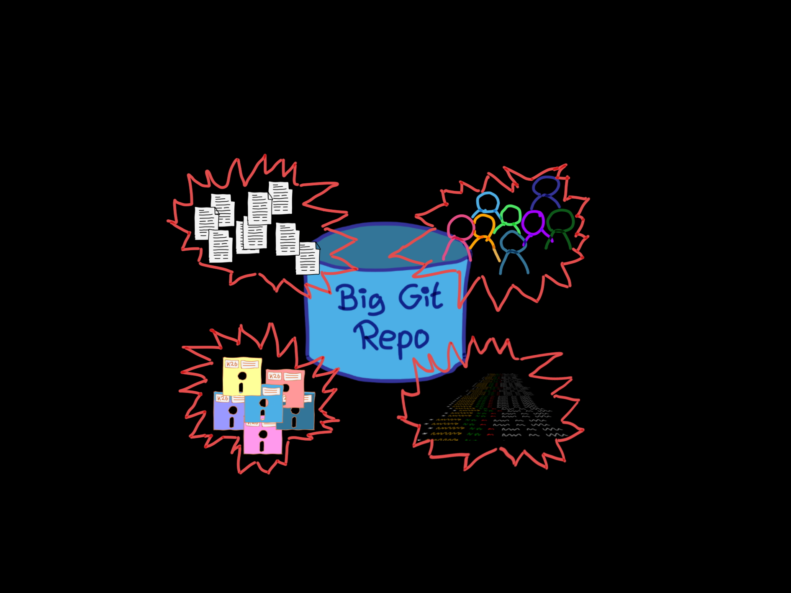

<!-- .slide: data-background-image="sections/monorepo/monorepo.png" -->


# MONOREPO TODO


---


### Wie viele
 
Dev Teams   
Files  
Lines of Code  
# **?**

notes:

Schätzen Sie!

über ihr **gesamtes Unternehnmen**

Dev Teams: Wer hat mehr als 2, 5, 10, 20, 50, 100, 500 

Files: Wer hat mehr als 1000, 10.000, 500.000, 1.000.000

Lines of Code: Wer hat mehr als 100.000, 1 Mio., 10 Mio., 100 Mio. 


---

# Think Big! <br/><br/><br/><br/>

<!-- .slide: data-background-image="sections/monorepo/tyranno-watching.png" -->


---

Kleines Gedankenexperiment:

## Tun Sie all das in
# **1 Repo**!


---

... zu groß 
... zu träge 
... bürokratisch
... ständige Konflikte 
... und wo bleibt die Teamautonomie   
... voll unagil
... was geht mich das Zeug aus den anderen Abteilungen an
... zentralistisch
... jedes Klonen dauert ewig
...


---

aber manche machen das, z .B.

 * Google
 * Facebook
 * Microsoft
 * Twitter

### Sind die denn komplett verrückt?


---


Ein **Monorepo** unterstützt

 * Large Scale **Refactorings**
 * **API** Migrationen
 * **Analysen** \
   Vulnerability, Defects, Usage, Data Lineage
 * **Aufräumen**

notes:

 * Umstellen auf Major Releases von C++, PHP
 * Wann kann ich ein API abschalten?
 * Nicht alle Großen machen das: Amazon, Netflix

---
## Voraussetzungen

 1. **1** Repo für Alles™
 2. Trunk Based Development
 3. Commitment auf Stabilität von `main`   
 4. Skalierbare Build-Pipeline 

> Google ist versioniert!


notes:

Erfordert:

 1. Technologie, Invest und Team.
 2. Nur der `main`-Stand ist relevant 
 3. Erfordert Reife in Governance.
 3. Tooling (z.B. Bazel).


---

<div style = "font-family: 'Times New Roman';">

> QUOD LICET JOVI \
> NON LICET BOVI

</div>

Die Riesen dürfen und können das. \
Sollen wir, die Zwerge, nachziehen?

notes:

Diese Frage lassen wir offen.


---

## Monorepo

| **👎**   | **👍**                      |
|:-------------:|:-------------:|
| Hoher Invest in<br/>Infrastruktur + Team   | Large Scale Refactoring |
| Governance Maturity<br/>notwendig   | übergreifende Analysen |
| Zentrale<br/>Abhängigkeit           | Housekeeping (APIs/Code) |

notes:

Knifflige Entscheidung, weil \
kurzfristiger Invest hoch, \
Nutzen aber in langristigen Aspekten liegt.


---


<!-- .slide: data-background-image="sections/monorepo/gross.png" -->


Wenn Sie Monorepo aufbauen,  
werden sie ein großes Repo bekommen,

## aber was heißt hier eigentlich

# GROß?


---


### Dimensionen von "groß"

 * Viele Dateien
 * Viele Bytes
 * Viele Leute
 * Viele Änderungen


---


Jede Dimension birgt ihre eigenen Herausforderungen.


---





---

<!-- .slide: data-background-image="sections/monorepo/viele-dateien.png" -->

## Viele Dateien!<br/><br/><br/>


---


## Viele Dateien - Probleme


 * `checkout` langsam!
 * IDE glüht!
 * `status` langsam!


notes:

 * Performance des Filesystems beim initialen Auschecken und Branch wechseln
   - `checkout` und andere Befehle, die den Workspace manipulieren.
 * Performance der IDE bei vielen offenen Projekten
 * Performance von Git beim Status-Befehl


---


#### Viele Dateien - `checkout` langsam!

### Abhilfe: Sparse Checkout

Filtern, welche Dateien\
in den Workspace geholt werden.

notes:

 * `git clone` mit  `--sparse` \
   [aktiviert Sparse Checkout](https://git-scm.com/docs/git-clone#Documentation/git-clone.txt---sparse)
 * `git sparse-checkout add/list/set/...` \
   [bearbeitet](https://git-scm.com/docs/git-sparse-checkout) die [Konfiguration](https://git-scm.com/docs/git-sparse-checkout#_sparse_checkout) in \
   `$GIT_DIR/info/sparse-checkout`.


---


#### Viele Dateien - `checkout` langsam!

### Abhilfe: Sparse Checkout

```bash
# Sparse Checkout einrichten
git clone --sparse repo myclone
cd myclone
git sparse-checkout init --cone
git sparse-checkout add component-a
git checkout

# Sparse Checkout abschalten
git sparse-checkout disable
```


notes:


TODO Anmerkungen zu Usage von Sparse-Checkout


---


#### Viele Dateien - IDE glüht!

### Abhilfe

 * *Sparse Checkout* hilft oft auch hier

 * Monorepo `!=` Monolith

   Modulverzeichnise können/sollten  
   separate IDE-Projekte sein.


---

#### Viele Dateien - `status` langsam!

### Abhilfe: Watchman

 * [Watchman](https://facebook.github.io/watchman/) von Facebook
   lauscht auf File-System-Events und hält einen Cache.
 * Über [Hook](https://github.com/git/git/blob/master/templates/hooks--fsmonitor-watchman.sample) in Git integrieren
 * Erster `status`-Aufruf startet Daemon,  
   Nachfolgende nutzen den Watchman-Cache.


```bash
git config core.fsmonitor .git/hooks/query-watchman
```

---


