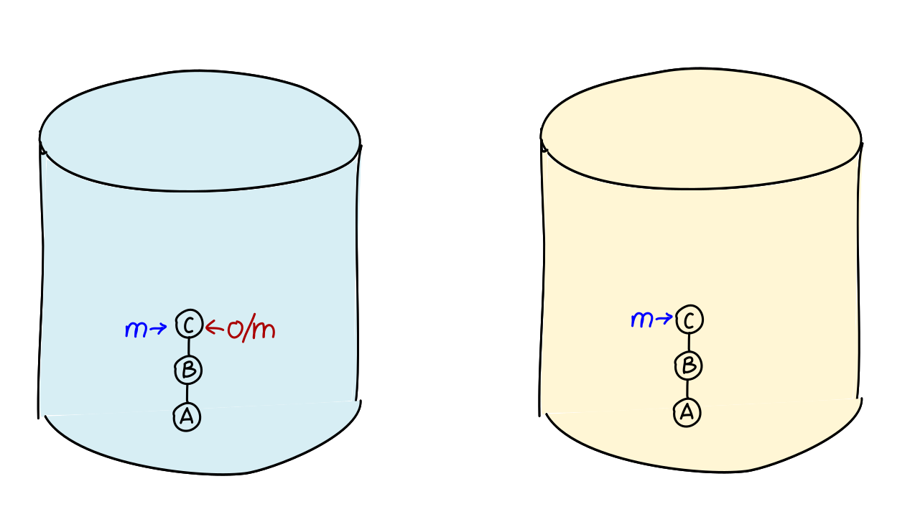
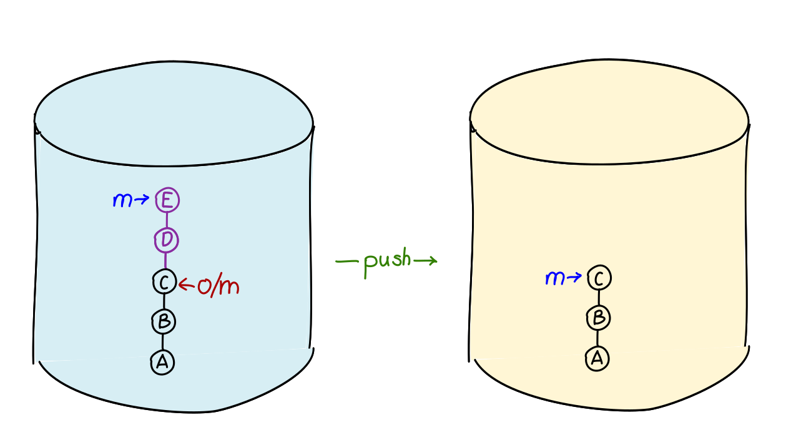
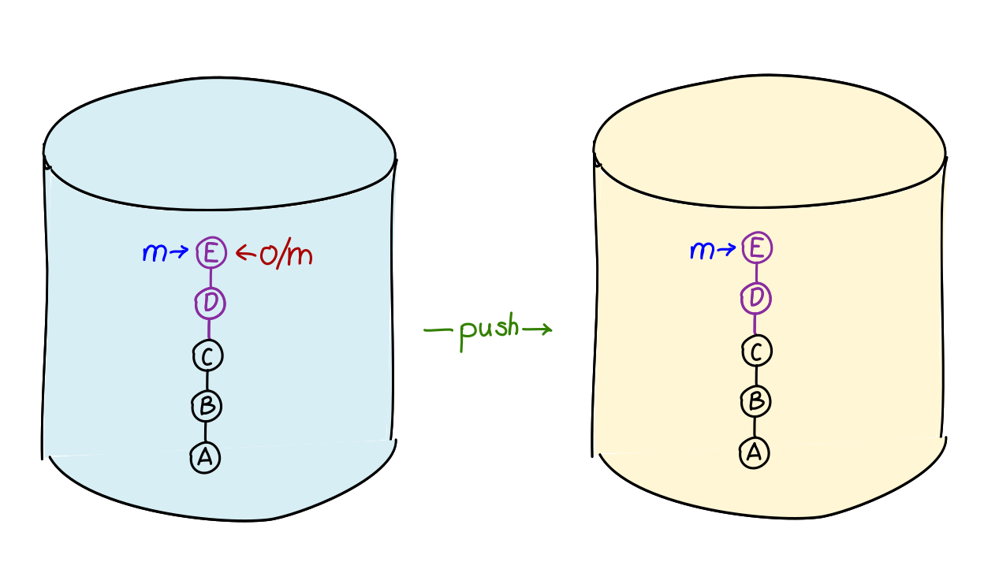
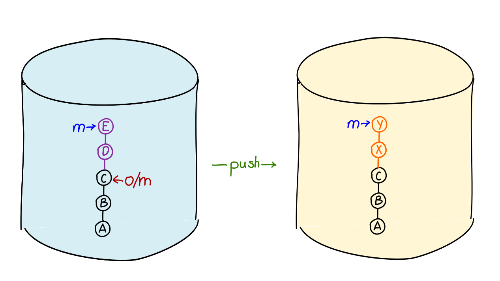
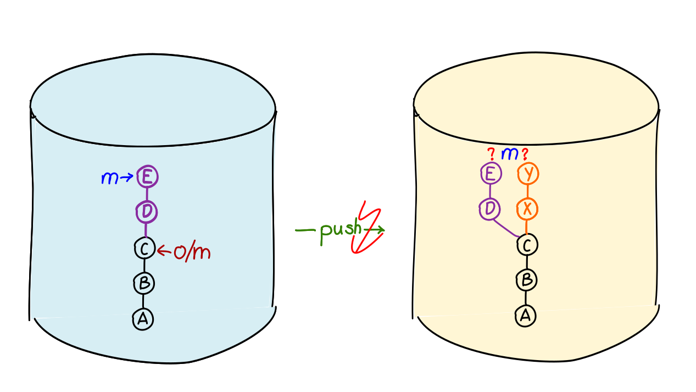

### Learning Goals (Commands)

```bash
    git fetch
    git pull
    git push
```

---

### Synchronization

```bash
    git fetch      # remote -> local
    git push       # local -> remote
```

Delta transfer

   1. Compares remote ref with the current state
   1. Determines missing commits, trees, and blobs and transfers these objects
   1. Updates remote refs

Notes:

You can also sync with unrelated repositories.

---

How does synchronization work?

---

After cloning, everything is the same.



---

New commits should be transferred via `push`.



---

Commits have been transferred and refs updated.



---

### Push

#### Transfers from the *active branch* to the remote repository.

```bash
git push
```

Or more specifically:

```bash
git push origin master
```

Note: `origin master` (remote + local branch) not `origin/master`

---

### Fetch

#### Fetches *all branches* from the remote repository.

Synchronizes and updates remote refs.

Workspace and active branch remain unchanged.

```bash
    git fetch
    git fetch origin
```

---

### Pull

A combination command

```bash
git pull
```

 1. Fetch changes (`git fetch`)
 1. Apply changes to the current branch \
    (`git merge`, next chapter).

---

<iframe src="markdown-git-uebungen/aufgabe-zusammenarbeit-push-fetch-pull.html" width="100%" height="600px" ></iframe>

---

### Push rejected

---



[Push Reject](repo-push-rejected.svg)

---



---

### Push rejected

> Rule of thumb: Never destroy history!

All commits that were previously in the branch's history must still be there afterward.

Technically: When pushing, the new commit must be a descendant of the previous one!

-> The conflict must now be resolved locally!

---

<iframe src="markdown-git-uebungen/aufgabe-zusammenarbeit-push-rejected.html" width="100%" height="600px" ></iframe>


