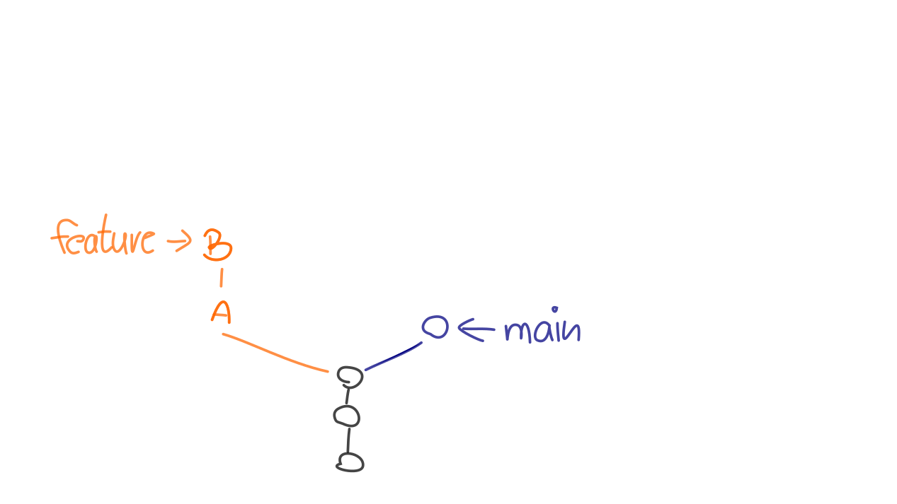
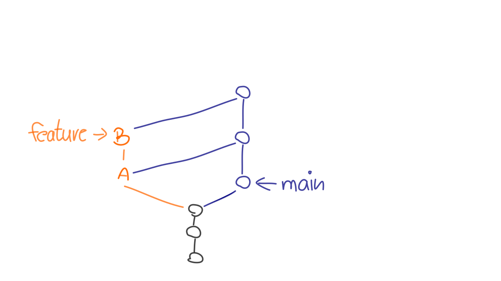
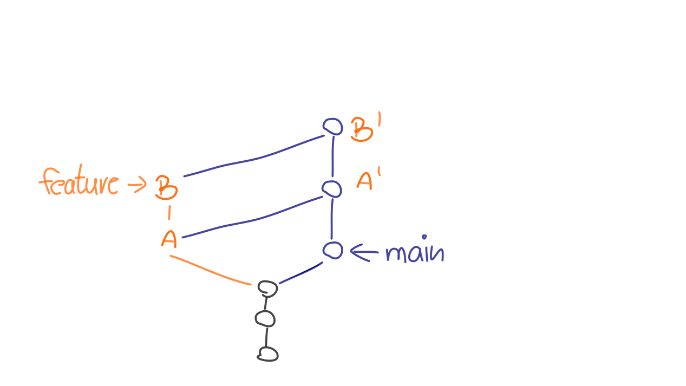
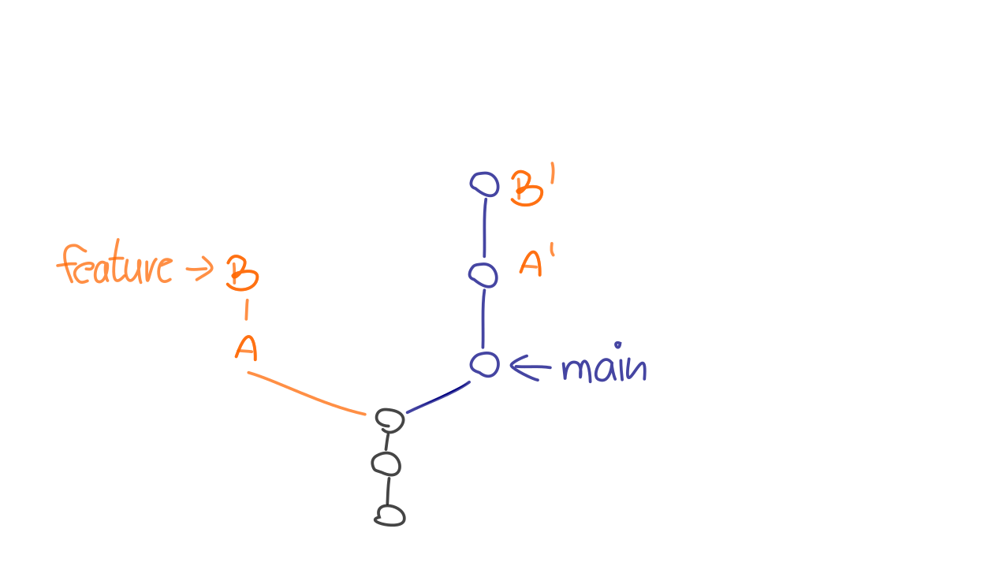
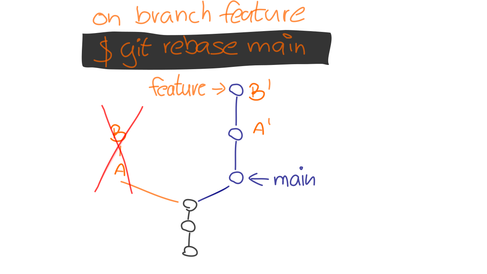
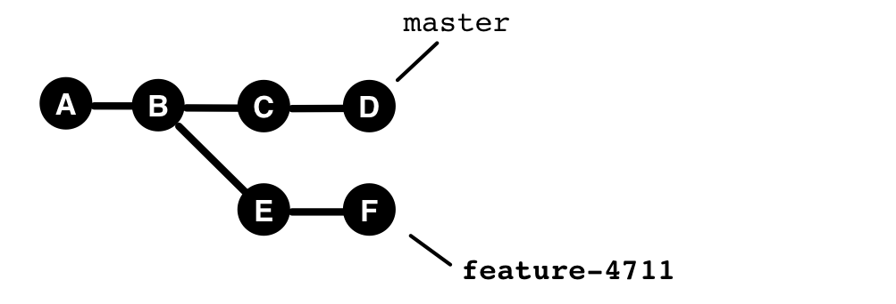
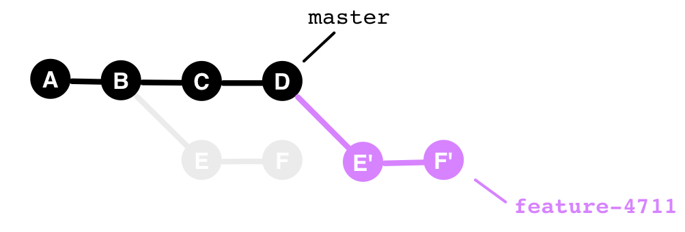

# Rebasing

---

## Learning Goals

```
    rebase / rebase --interactive
```

 * Rebasing **duplicates commits**
 * **Risks** and side effects
 * **Interactive Rebasing**

---

Merge and Rebase are closely related:

---



---



---



---



---



---

### Rebase Example 1



---

### Rebase Example 2



---

### Rebase - Application

    git rebase newbase

Which commits? Where to?

 * The new commits are created on `newbase`
 * Duplicated are:
   - HEAD..newbase
   - All commits in HEAD that are not yet in newbase

Without parameters: Upstream Branch.

    git rebase

---

### Rebase - Conflicts

 * theirs vs. ours


---

<iframe src="markdown-git-uebungen/aufgabe-zusammenarbeit-rebasing.html" width="100%" height="600px" ></iframe>


---


## Risks and Side Effects

### Problems with Duplicated Commits

### (In-)Visibility of Integrations


---

# Interactive Rebasing

---

Code-Reviews
============

If you have only one quality gate and go directly into production, <BR>
then good code reviews are important.

---

#### The Problem

With feature branches, so many changes often occur that the review at the end becomes very complex.


#### Approach

Do not review "the diff" at the end of the branch<br/>
but each commit individually.

---

#### The Problem with That

Too many commits. Often unstructured.

#### Solution

*Interactive Rebasing* creates a readable history.


---


### Related Commands

 * `commit --amend`
 * `reset HEAD~1`
 * `cherry-pick`
 * `filter-branch`


