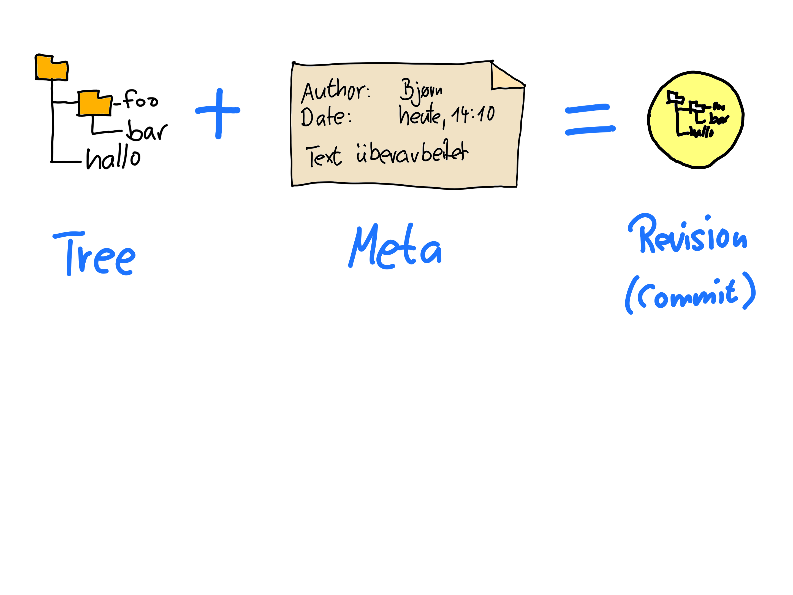

## Repository

**Git** ist eine Versionsverwaltung.

Ein Git-**Repository** ein ist eine (hochspezialisierte) Datenbank zur Archivierung von Entwicklungsständen eines Softwareprojekts.

Das Repository enthält sämtliche Versionen aller Dateien des Projekts inklusive Information über Autoren und Zeitpunkte von Änderugen.

---

### Ein Projektverzeichnis enthält:

Das **Repository** (es liegt in `.git`).
Es enthält die gesamte Historie des Projekts:
Alle Versionen aller Dateien, Informationen über Autoren und Änderungszeitpunkt, alle Verzweigungen (*Branches*) und *Tags*.

Der **Workspace** (alle anderen Dateien und Verzeichnisse, die nicht in `.git` liegen)
enthält die Dateien und Verzeichnisse *eines Versionsstandes* (genannt  `HEAD`) zur Bearbeitung.

---

## Demo: `git-workshop` zeigen

---

### Der Workspace

umfasst alle Dateien und Verzeichnisse des Projekts

 * **versionierte Dateien**
   Dateien, die in der aktuellsten Git-Revision des Projekts,
   `HEAD` genannt, schon bekannt sind.
 * **unversionierte Dateien**
   Neue Dateien, die Git "noch nicht kennt".
 * **ignorierte Dateien**
   Die gar nicht versioniert werden sollen (Stichwort: `.gitignore`)

---

### Repository

Damit Git **dezentral** (unabhängig vom Server) arbeiten kann,
enthält es eine Datenbank
mit der **gesamten Historie** eines Projekts.

 * alle Versionen aller Dateien
 * Metadaten: Autor, Zeitpunkt
 * Branches: Ermöglichen parallele Entwicklungsstränge
 * Markierte Versionen, genannt Tags

---

---

### Begriffe 

**Commit,Revision** ist ein eingefrorener Versionsstand über *alle Dateien des Projekts*.

**`HEAD`** steht für jenes *Commit*, das im Workspace bearbeitet wird.

**Log**: Die Historie. Bezeichnet die Menge aller Commits, die zur Entstehung des `HEAD` beigetragen haben.

