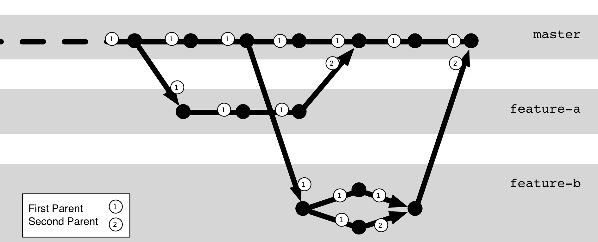
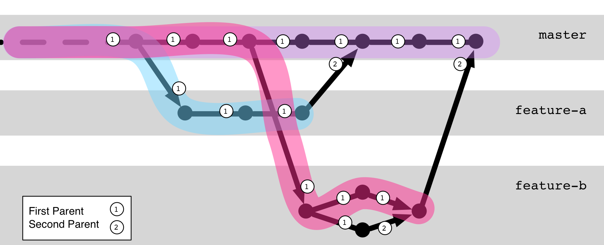

## 1st-Parent-History

Bei einem Merge, repräsentiert der erste *Parent*,
idR. jenen Branch auf dem das Merge durchgeführt wurde.

---

**1st-Parent** dient als Heuristik für Branch-Zugehörigkeit.

