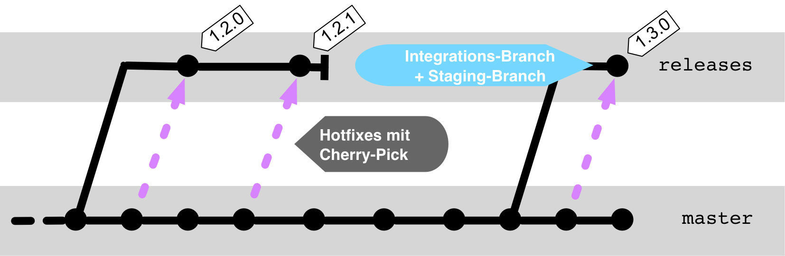

# Workflow
## Developing on `master`

Multiple developers work together on a `master` branch.

<!-- .slide: data-background-image="sections/workflow-auf-dem-master-entwickeln/trunk-based.png" data-background-opacity="0.4" -->


---

### Pull = Fetch + Merge

```bash
    git pull some-repo some-branch

    # Without parameters: Integration with the upstream branch, e.g., origin/master
    git pull
```


What was merged in?

    log HEAD^2..HEAD
    diff HEAD^2...HEAD


---

### Process

1. Fetch changes
        git pull
1. Resolve merge conflicts if necessary
1. Develop
1. Send changes
       git push
1. Return to step 1.


---


## Trunk-Based Development



* Stable master branch. Frequent releases.

