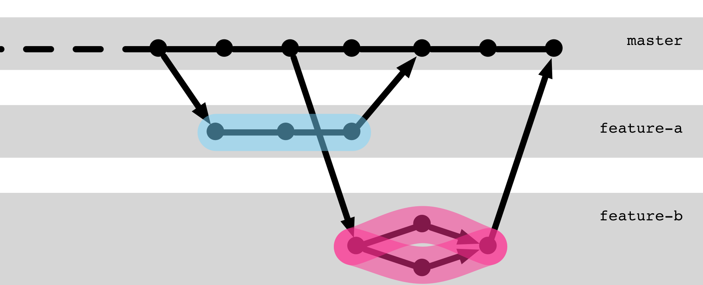

## Collaborating on a Branch

<!-- .slide: data-background-image="sections/workflow-collaboration/trunk-based.png" data-background-opacity="0.4" -->

---

## Collaboration Branch

---

## Collaboration Branch

### Working Together on a Branch

 * Multiple developers, 1 branch
 * Push & Pull 
 * Tip: `pull --rebase` creates a *linear history*.

---

### Process

1. Fetch changes
        git pull
1. Resolve merge conflicts if necessary
1. Develop
1. Send changes
       git push
1. Return to step 1.

---

[Trunk-based development](https://trunkbaseddevelopment.com/)

 * Stable master branch
 * Frequent releases
 * Often with *Feature Toggling*

