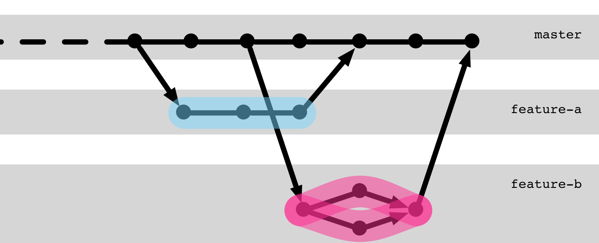
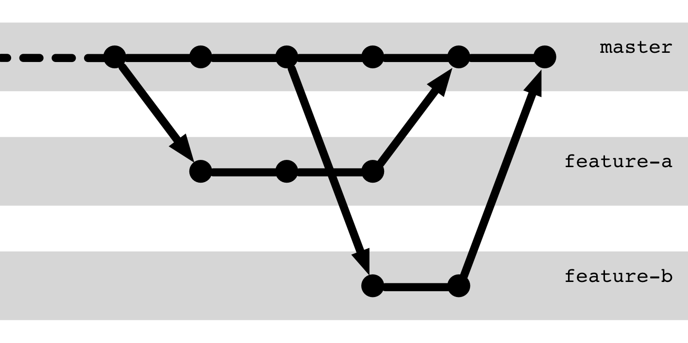
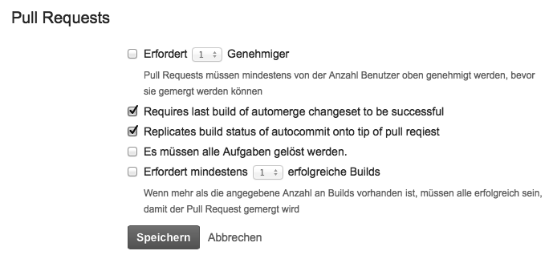

# Zusammenarbeit

---

> **Donald Knuth** once said that the 
> ideal team size in software development is one.

---

### [To Branch or Not to Branch](https://kapitel26.github.io/slides/2019-10-27-to-branch-or-not-to-branch/)

---

## Auf einem Branch gemeinsam entwickeln

<!-- .slide: data-background-image="sections/workflow-collaboration/trunk-based.png" data-background-opacity="0.4" -->

---

## Kollaborations-Branch

---

## Kollaborations-Branch

### Auf einem Branch zusammenarbeiten

 * Mehrere Entwickler, 1 Branch
 * Push & Pull 
 * Tipp: `pull --rebase` schafft *lineare Historie*.

---

### Ablauf

1. Änderungen Abholen
        git pull
1. ggf. Mergekonflikte lösen
1. Entwickeln
1. Änderungen senden
       git push
1. Zurück zu Schritt 1.

---

[Trunk based development](https://trunkbaseddevelopment.com/)

 * Stabiler Master-Branch
 * Häufige Releases
 * oft mit *Feature-Toggling*

---

## Feature branching

Notes:

Das elementarste Pattern

Wichtig: Verknüpfung mit Issue-Tracker

---

### Feature-Branch

 * Entkoppelte Entwicklung
   - weniger Störungen
   - Basis für Reviews
 * Lebenszyklus je Feature
   - ermöglich unabhängige Releases
   - Typisch: Verknüpfung mit Issue-Tracker

---

## Pull-Request

(Auch Merge-Request genannt.)

---

## Pull-Request

 * separarierte Entwicklung
 * Jemand anderes (Maintainer/Kollege) integriert
 * Quality-Gate: Review, autom. Checks
 * dokumentierte Integration

---

## Pull-Request Demo

