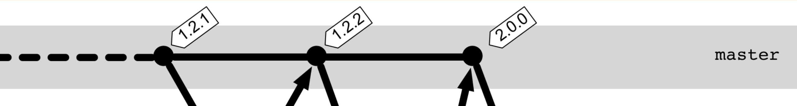
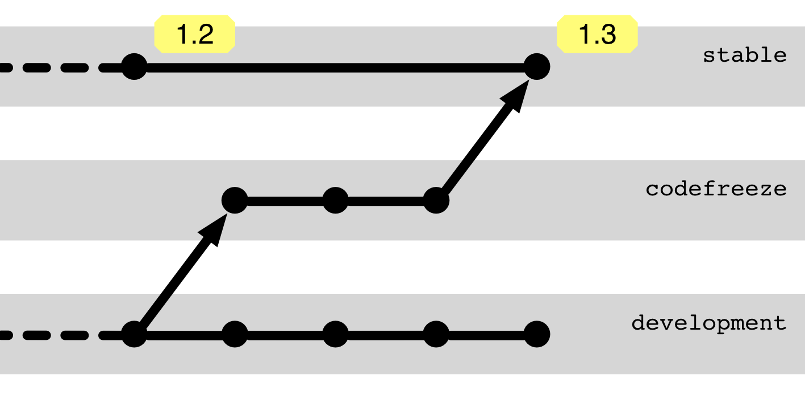

## Tags Mark Delivered Versions

 * *Annotated Tag* (with metadata)
 * Tag is attached to a commit
 * Only the commit hash uniquely identifies the software state
 * Often: [Semantic Versioning](https://semver.org/)
 * GitHub, GitLab, Azure DevOps & Co. allow additional descriptions

---

### Quality Assurance Before Release

 * Pull requests on `main` with automated tests \
   and mandatory review
 * Automated tests for every commit \
   + Pair programming
 * Manual tests + reviews before setting the tag 
   (usually requires a freeze phase)
 * Staging branches
   (separate the freeze phase)

---

## Staging Branches

---

## Staging Branches

Represent quality levels, e.g.,

 * `develop`: Buildable, may show unfinished features.
 * `release`: Finished features, not yet approved
 * `main`: Approved version for customers

