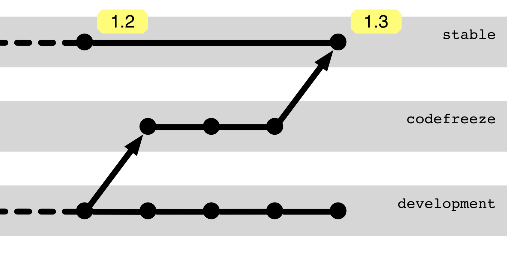

## Tags markieren ausgelieferte Versionen

 * *Annotated Tag* (mit Metadaten)
 * Tag wird an ein Commit geheftet
 * Nur das Commit-Hash identifiziert den Softwarestand eindeutig
 * Oft: [Semantic Versioning](https://semver.org/)
 * GitHub, GitLab, Azure Devops & Co. ermöglichen zusätzliche Beschreibung

---

### Qualitätssicherung vor dem Release

 * Pull-Requests auf `main` mit automatischen Tests \
   und obligatorischem Review
 * Automatische Tests bei jedem Commit \
   + Pair-Programming
 * Manuelle Tests + Reviews vor dem setzen des Tags 
   (erfordert meist Freeze-Phase)
 * Staging-Branches
   (separieren die Freeze-Phase)

---

## Staging-Branches

---

## Staging-Branches

Repräsentiere Qualitätsniveaus, z. B.

 * `develop`: Build-fähig, darf unfertige Features zeigen.
 * `release`: Fertige Features, noch nicht abgenommen
 * `main`: Abgenommene Version für Kunden

