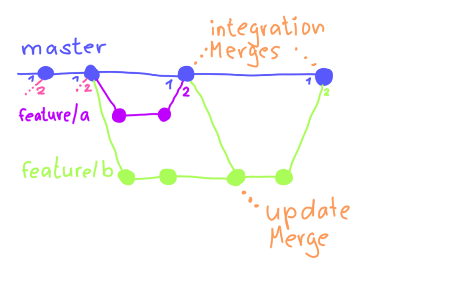

---

## Feature Branching

### (Workflow)

<!-- .slide: data-background-image="sections/workflow-feature-branching/feature-branch.png" data-background-opacity="0.15" -->

---

---

## Feature Branching

 1. 1 branch per feature
 2. Develop independently
 3. Integrate when done

---

---

 * Integration Merges
   - To the main branch when done. 
   - Branch can be deleted

 * Update Merges
   - In the feature branch when changes are on the main branch

 * Pre-integration
   - Intermediate results to the main branch
   - Note: Disable unfinished work or use *feature toggling*

---

### Beware of Pitfalls!

Merges between feature branches can become problematic:

 * One feature can no longer be delivered without the other
 * Merge conflicts become more complex (possibly involving three parties, distinction between *theirs* and *ours* becomes blurred)

Tip: Pre-integrations are often clearer and easier to handle.

---

## Feature Branching

 * Decoupled development
   - Fewer disruptions
   - Basis for reviews
 * Lifecycle per feature
   - Enables independent releases
   - Typically linked to an issue tracker

