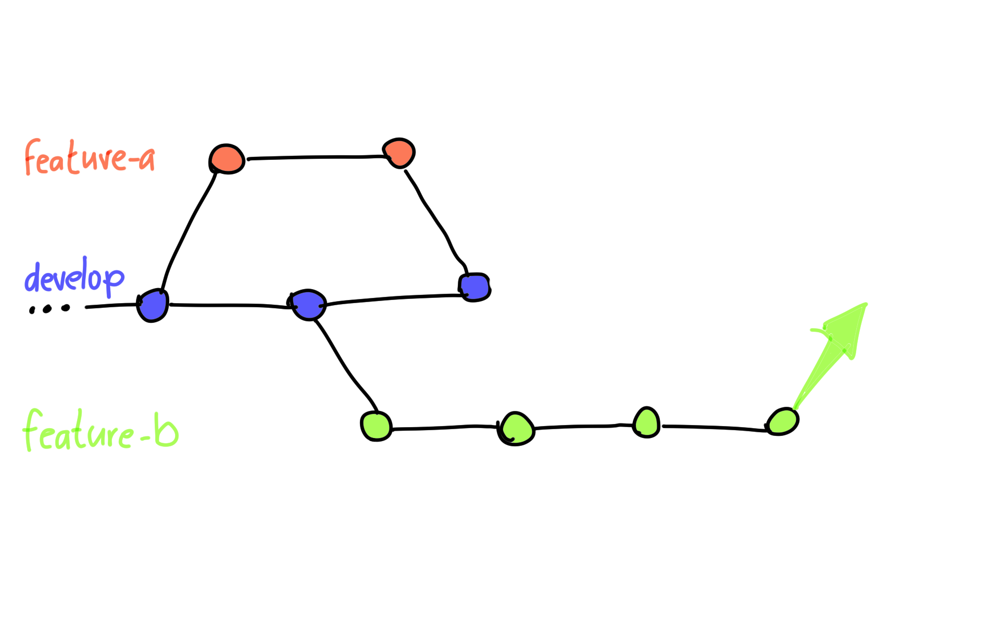

---

## Feature-Branching

### (Workflow)

<!-- .slide: data-background-image="sections/workflow-feature-branching/feature-branch.png" data-background-opacity="0.15" -->

---

---

## Feature Branching

 1. 1 Branch pro Feature
 2. Entwickle unabhängig
 3. Integriere, wenn fertig

---

---

 * Integrations-Merges
   - Auf den Hauptbranch, wennn fertig. 
   - Branch kann gelöscht werden

 * Update-Merges
   - Im Feature-Branch, wenn Änderungen auf dem Hauptbranch

 * Vorabintegration
   - Zwischenergebnisse auf den Hauptbranch
   - Achtung: Unfertiges deaktivieren oder *feature-togglen*

---

### Achtung Fallstrick!

Merges zwischen Features-Branches können problematisch werden:

 * Ein Feature kann nicht mehr ohne das andere ausgeliefert werden
 * Merge-Konflikte komplexer (ggf. drei Parteien beteiligt, Trennung zwischen *theirs* und *ours* verwässert)

Tipp: Vorabintegrationen sind oft klarer und einfacher zu handhaben.

---

## Feature Branching

 * Entkoppelte Entwicklung
   - weniger Störungen
   - Basis für Reviews
 * Lebenszyklus je Feature
   - ermöglich unabhängige Releases
   - Typisch: Verknüpfung mit Issue-Tracker

