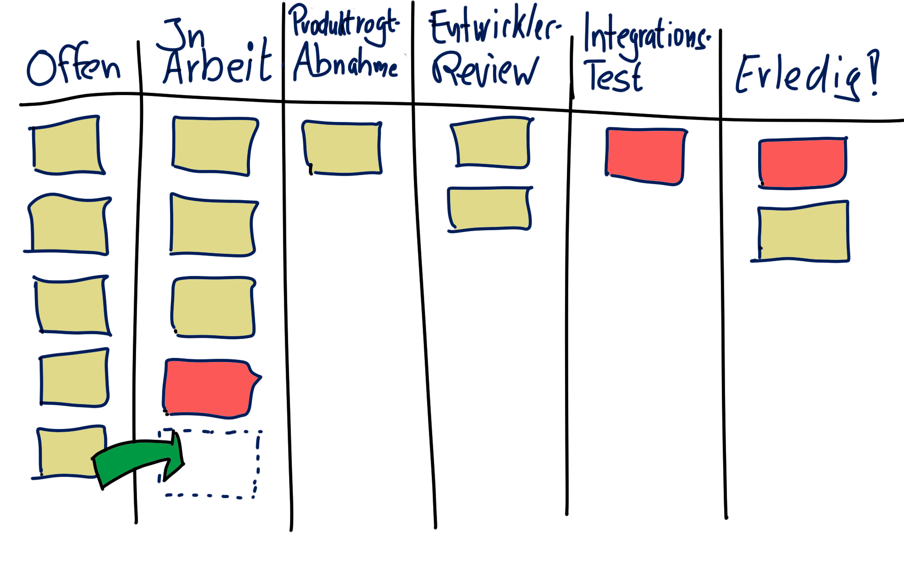
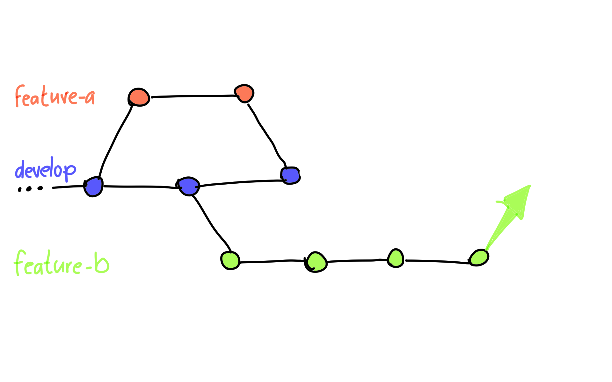
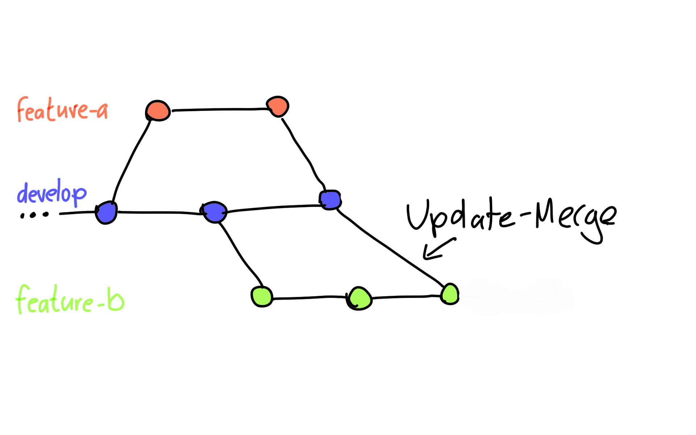
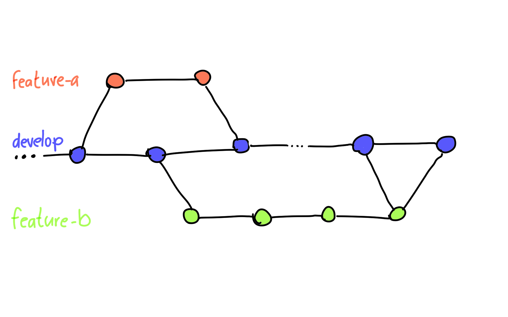

Agile Projekt nutzen oft *Boards* die Arbeit zu koordinieren.

 

---

Die Entwickler arbeiten dann Story/Task/Bug-Karten ab. Es liegt nahe, für jede Karte einen Branch abzuzweigen.

---

Gibt es Neuerungen auf dem Hauptbranch, kann der *Feature Branch* durch ein *Update-Merge* auf den neuesten Stand gebracht werden.

---

Vor dem Merge in den Haupt-Branch steht meist *Quality Gateway* 
mit Reviews und Tests an.

---

Wenn ein Feature fertig gestellt ist, wird es in den Hauptbranch integriert. 

---

Es ist möglich, vorab Zwischenergebnisse auf den **Hauptbranch** zu bringen.
Es empfiehlt sich dann das unfertige Feature durch **Feature-Toggles** vor
ungeplanter Benutzung zu schützen.
