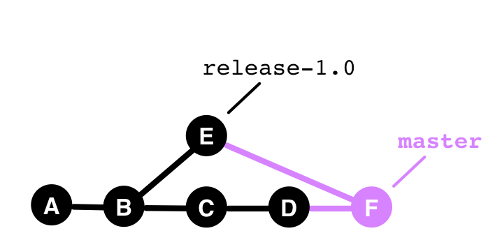
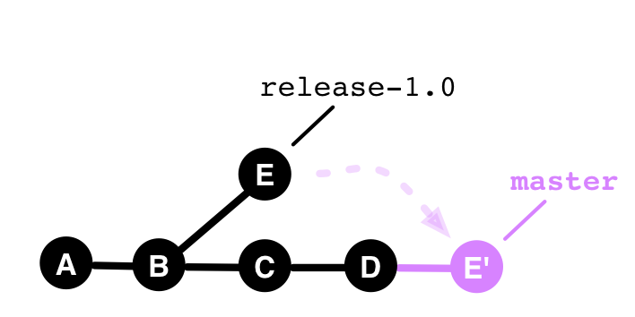
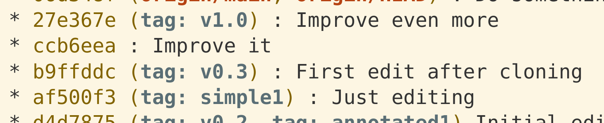
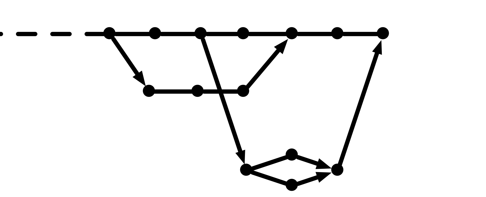

## The Toolbox

Git does not prescribe a specific *workflow*.

It offers a range of *tools*,
which can be used in different ways.

Which tools are used and when
determines the *team workflow*.

The following tools are crucial:

---

## Branch

 

---

## Merge

* Creates a new commit
* Two parents

---

## Cherry-Pick (Before)

---

## Cherry-Pick (After)

 

  * Copies commits
  * No structural connection between copied commits.

---

## Rebase (Before)

  

---

## Rebase (After)

  

 * Copies commits
 * Appears as if the commits were moved.

---

### Warning! -  Rebase changes history.

* OK for local changes.
* OK for feature branches in closed teams.
* Not OK otherwise.

---

## Tags

(Annotated) Tags mark commits for important milestones, e.g., releases.

---

## History Tree

---

**Merges** show integrations,  
**Rebases** and **Cherry-Picks** hide them.
 

The choice of tools determines, 
which integrations the history tree shows.

---

## Toolbox

### for Workflows

| Tools                |
|----------------------|
| Branch               |
| Merge                |
| Rebase               |
| Cherry-Pick          |
| Tag                  |
| History tree         |
