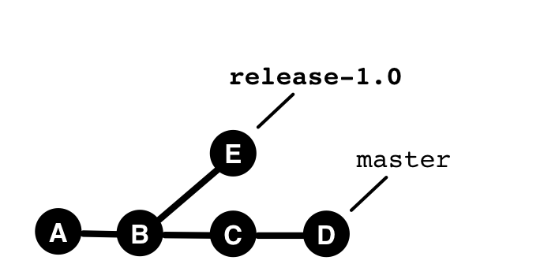

## Der Werkzeugkasten

Git gibt keine bestimmte *Arbeitsweise* vor.

Es bietet eine Reihe von *Werkzeugen*,
die unterschiedlich eingesetzt werden.

Welche Tools man wann einsetzt,
bestimmt den *Workflow im Team*.

Die folgenden Werkzeuge sind entscheidend:

---

## Branch

 

---

## Merge

* Erzeugt neues Commit
* Zwei Parents

---

## Cherry-Pick (Vorher)

---

## Cherry-Pick (Nachher)

 

  * Kopiert Commits
  * Kein struktureller Zusammenhang zwischen kopierten Commits.

---

## Rebase (vorher)

  

---

## Rebase (nachher)

  

 * Kopiert Commits
 * Sieht dann nachher so aus, 
   als wären die Commits verschoben.

---

### Achtung! -  Rebase verändert die Historie.

* OK, für lokale Änderungen.
* OK, für Features-Branches in geschlossenen Teams.
* Nicht OK, sonst.

---

## Tags

(Annotated) Tags markieren Commits zu wichtigen Meileinsteinen, z.B. Releases.

---

## History-Tree

---

**Merges** zeigen Integrationen,  
**Rebases** und **Cherry-Picks** verbergen sie.
 

Mit der Wahl der Werkzeuge bestimmt man, 
welche Integrationen das History-Tree zeigt.

---

1st-Parent-History
------------------

**1st-Parent** dient als Heuristik für Branch-Zugehörigkeit

---

## Werkzeugkasten

### für Workflows

| Werkzeuge             |
|-----------------------|
| Branch                |
| Merge                 |
| Rebase                |
| Cherry-Pick           |
| Tag                   |
| History tree          |
