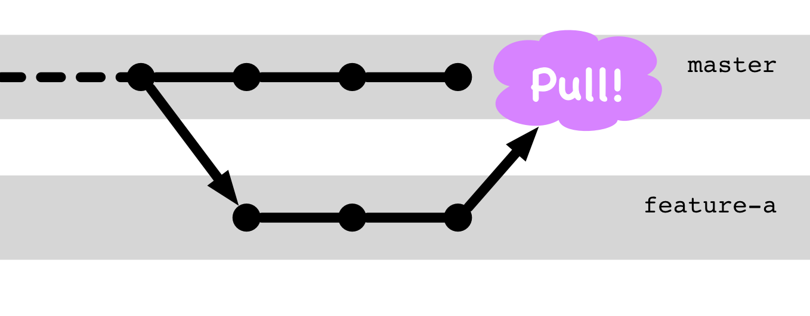

## Pull-Request

(Auch Merge-Request genannt.)

---

## Pull-Request

 * separarierte Entwicklung
 * Jemand anderes (Maintainer/Kollege) integriert
 * Quality-Gate: Review, autom. Checks
 * dokumentierte Integration

---

## Pull-Request Demo

